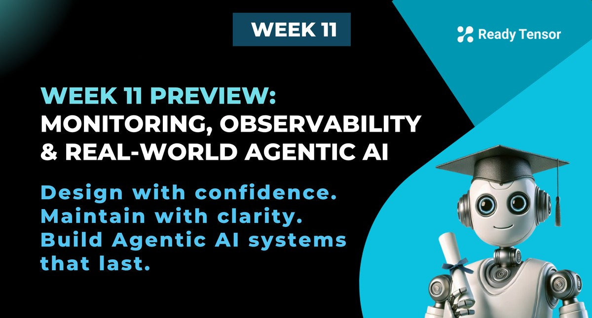

--DIVIDER--

---

[🏠 Home - All Lessons](https://app.readytensor.ai/hubs/ready_tensor_certifications)

[⬅️ Previous - Agentic System Documentation Guide](https://app.readytensor.ai/publications/Al9E4GsrKoKC)
[➡️ Next - Monitoring & Observability](https://app.readytensor.ai/publications/3p414r28A7UU)

---

--DIVIDER--

# TLDR

This week covers a set of critical topics that every production-ready agentic AI system needs: monitoring, debugging, compliance, and deployment decisions.

---

--DIVIDER--

# What’s in store this week?

This week, we cover a set of critical — and distinct — topics that don’t always get taught together, but every production-ready system depends on them.

We’ll cover:

- **Lesson 1a: Monitoring and Observability 101**
  Understand the difference between monitoring and observation - and building blocks such as metrics, logs, and traces.

- **Lesson 1b: What to Monitor**
  Learn how to track failures like hallucinations, bad routing, and tool misuse. We’ll map common failure modes and their causes to the right metrics and traces.

- **Lesson 1c: Choosing Monitoring Tools**
  Compare popular observability tools for agentic systems, including LangSmith, Langfuse, OpenTelemetry, and others. You’ll learn what to look for and how to choose based on your stack and scale.

- **Lesson 1d: Diagnosing Root Causes**
  Go a level deeper to understand how to debug agentic AI systems when they misbehave.

* **Lesson 2**: Data Privacy and Compliance
  Learn how to design with privacy and compliance in mind. We’ll cover the implications of GDPR, HIPAA, and other frameworks when agents handle sensitive data.

* **Lesson 3**: Hosted Models vs APIs
  Explore when to use hosted models versus API-based LLMs, and how to weigh tradeoffs like latency, control, compliance, reliability, and cost.

- **Lesson 4**: Real-World Development Blueprints
  Walk through real-world agentic AI development blueprints, starting from project planning through development and deployment.

By the end of this week, which also marks the final set of lessons in the program, you’ll have a complete understanding of the essential skills needed to take an agentic AI system to production, and set it up for success beyond.

These are the skills that make the difference between a working prototype and a real-world AI system.

Let’s get started!

--DIVIDER--

---

[🏠 Home - All Lessons](https://app.readytensor.ai/hubs/ready_tensor_certifications)

[⬅️ Previous - Agentic System Documentation Guide](https://app.readytensor.ai/publications/Al9E4GsrKoKC)
[➡️ Next - Monitoring & Observability](https://app.readytensor.ai/publications/3p414r28A7UU)

---
