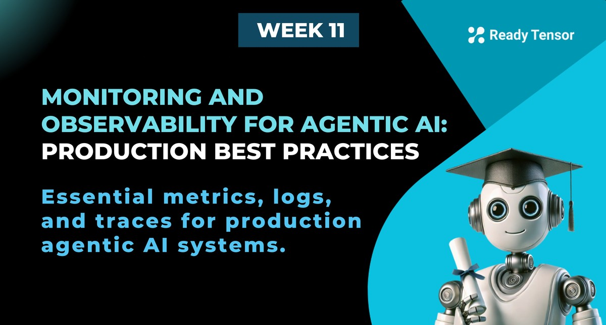
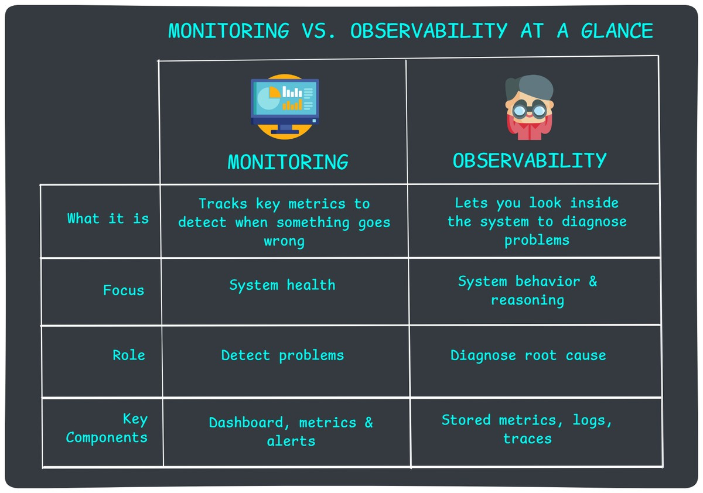
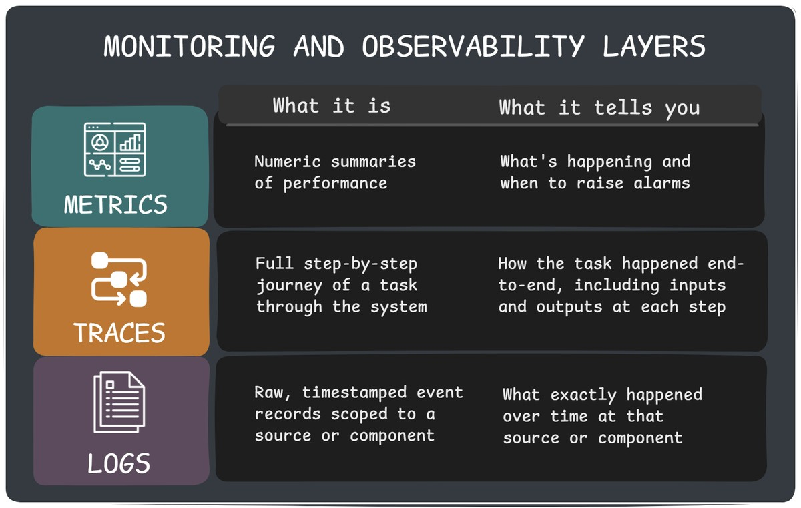
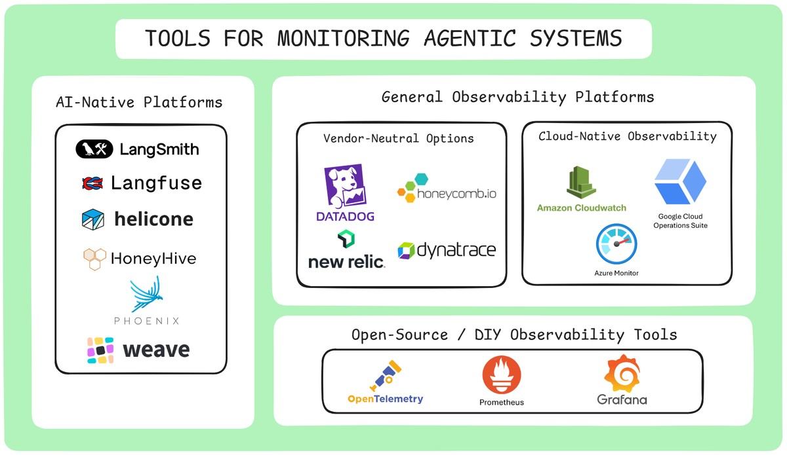

--DIVIDER--

---

[🏠 Home - All Lessons](https://app.readytensor.ai/hubs/ready_tensor_certifications)

[⬅️ Previous - Week 11 Preview](https://app.readytensor.ai/publications/dkWUcl9DJl6b)

---

--DIVIDER--

# TL;DR

Like any production system, agentic AI can — and will — fail. But debugging it is uniquely hard due to their complex workflows and non-deterministic outputs. This lesson shows you what to monitor so you can catch issues like hallucinations, tool misfires, and bad routing as they happen. You’ll learn how to log, trace, and track the right signals so that when things go wrong, you’re ready to investigate — not guessing in the dark.

---

--DIVIDER--

# The Crisis No One Saw Coming 🚨

It's Tuesday morning. Six months ago, you deployed a customer service chatbot for your financial services company. The launch went smoothly, customers seemed happy, and your boss called it a "success story."

Then your phone rings.

> "We need to talk. Now."
> It's your manager — and they don’t sound happy.

Twenty minutes later, you're in a conference room with your manager, the VP of Customer Experience, and someone from Legal. The VP slides a printout across the table showing customer satisfaction scores for the past week.

They've **plummeted**.

> "Look at these comments," the VP says:
> _"The chatbot told me my account was closed when it wasn't."_ > _"It kept giving me the wrong routing number."_ > _"I asked about my loan status three times and got three different answers."_

Your stomach drops.

The Legal person clears their throat: "We've had twelve formal complaints this week. Some customers are threatening to switch banks."

Your manager turns to you.

> "What's going on? The system hasn't crashed. No error alerts. But customers say the bot was fine last month — and now it's giving wrong answers."

You stare at the feedback, mind racing. Everything looks green on your monitoring dashboard — uptime, response times, API calls. As far as you know, the system is running normally.

But clearly, something has gone **very wrong**.

> "We need answers today," the VP says.
> "If we can't figure this out, we're pulling the chatbot offline."

---

--DIVIDER--

# The Uncomfortable Reality

As you try to figure out where to even start investigating, the hard truth hits you:

- **When did this start?** You have no idea.
- **How many customers were affected?** No clue.
- **What kind of wrong answers?** You don’t have the logs or traces to tell.

You’re flying blind — and the clock is ticking.

Sound stressful?

Good. That’s the point.

Because this lesson is about preparing for exactly this moment — before it happens. We’re going to show you what to monitor, track, and log in an agentic system so you’re never flying blind again.

In the next lesson, we’ll show you how to actually debug a system once you know something’s off.

But right now, our goal is simple:

> **Make your agentic AI system something you can see inside.**

Let’s get started.

---

--DIVIDER--

# Why Monitoring Agentic AI Is Different

You already know you need monitoring — the question now is, _what kind?_

In traditional software systems, monitoring is about uptime, latency, and error codes. You watch for crashes, timeouts, and failed API calls.

But agentic AI systems don’t fail that way.

They don’t throw errors when they hallucinate a wrong answer. They don’t crash when they loop through reasoning steps that go nowhere. They don’t raise alerts when a tool is misused or a router sends a task to the wrong agent.

Everything still “works” — technically — even when it’s failing your users.

That’s why agentic AI demands a different approach. You don’t just need monitoring — you need behavioral observability: the ability to see what your AI did, why it did it, and what happened next.

Let’s look at what that takes.

---

--DIVIDER--

--DIVIDER--

# The Foundations of Monitoring and Observability

Before we dig into specific metrics and data to track, let’s clear up a foundational question:

**What’s the difference between monitoring and observability?**

They sound similar — and they’re deeply connected — but they serve different purposes.

## Monitoring

Monitoring is about **watching system metrics** from the outside. It’s the layer that tells you something’s wrong — ideally, as soon as it happens. It tracks things like latency, error rates, and resource usage, and alerts you when these numbers cross certain thresholds.

> Think of monitoring as your **fire alarm system**. It doesn’t tell you where the fire started or why — just that it’s burning.

---

## Observability

Observability is what lets you **look inside the system** and understand what’s actually going on. It includes **metrics, logs, and traces** — the raw material you need to piece together what happened, how, and why.

> If monitoring is the alarm, observability is the **security camera footage, the incident logbook, and the blueprint of the building**.

---

So Which One Do You Need?

**Both. Always.**

> Monitoring answers "what is happening?" while observability answers "why is it happening?"

---

--DIVIDER--

## The Three Layers of Monitoring and Observability

To monitor and observe your agentic system effectively, you need visibility across three layers:

---

### **1. Metrics** – _The alarm system_

Numeric signals that help you detect problems quickly and measure performance over time.

Examples:

- Task completion rate
- Average latency
- Hallucination rate
- Guardrail violations (e.g. profanity, PII)
- Token usage per session
- Tool failure rate
- Fallback frequency

Metrics are great for triggering alerts and building dashboards. But they don’t explain _why_ something happened.

---

### **2. Traces** – _The full journey_

A trace shows how a task moved through your system — step-by-step, node-by-node. It connects everything: user input → reasoning steps → tool invocations → output.

Examples:

- Conversation flow across agents and tools
- Routing decisions
- Intermediate reasoning (e.g. “I chose this tool because…”)
- Timestamps and state transitions

Traces are essential for debugging agentic systems because they expose the actual _flow_ of logic and decisions.

---

### **3. Logs** – _The forensic evidence_

Logs capture raw inputs, outputs, and events as they happened. They’re granular, timestamped, and often verbose — but invaluable for pinpointing details.

Examples:

- Raw LLM inputs and outputs
- Tool call inputs and responses
- State mutations or error messages
- Safety filters triggered (e.g. profanity or PII)

Logs tell the story behind each step. When paired with traces, they’re your best tool for figuring out what actually happened.

---

--DIVIDER--

## What’s Absolutely Necessary to Track?

If you’re short on time or budget, start with this core set:

- **Metrics**: latency, hallucination rate, tool failure rate, token usage, turns-to-success, and session-level completion
- **Traces**: one full trace per session — even if it's just agent name, inputs, tool used, and output
- **Logs**: LLM input/output pairs, tool call inputs/responses, and any safety filter triggers

That alone will cover **most real-world troubleshooting** cases.

---

> 💡 Don’t try to build a perfect system from day one. Start with high-signal metrics and add depth as issues arise.

---

--DIVIDER--

# Tools for Monitoring Agentic Systems

There’s no single “best” tool for monitoring agentic systems — but most setups fall into three categories. Your choice depends on how tightly you want to integrate, how much control you need, and whether you prefer managed platforms or custom setups.

---

--DIVIDER--

--DIVIDER--

## 1. AI-Native Platforms

These platforms are purpose-built for LLM and agentic systems. They automatically log prompts, responses, tool usage, traces, and metadata — giving you a high-resolution view into how your agent is behaving.

**Examples**:

- **LangSmith** – Seamless integration with LangChain and LangGraph. Ideal for tracing multi-step agent workflows, inspecting tool calls, and debugging prompts
- **Langfuse** – Open-source and framework-agnostic. Offers full observability across LLM apps, including session-level dashboards and prompt versioning.
- **Helicone** – Acts as a proxy layer for OpenAI and Anthropic APIs. Tracks token usage, latency, and costs with minimal setup.
- **HoneyHive** – Collaborative analytics and evaluation tools for LLM apps. Emphasizes team workflows, user feedback, and qualitative review.
- **Weights & Biases (W&B Weave)** – An open-source framework for tracking LLM calls and application logic, designed to help debug AI applications in production.

These tools are great if you want quick, meaningful visibility without building custom infrastructure.

**But keep in mind:**

- Some are tightly coupled to specific frameworks or APIs.
- Hosted solutions may raise privacy or compliance concerns.
- Deep customization (like custom pipelines or enterprise-grade access control) may require workarounds or higher-tier plans.

If you're okay with managed services and want fast insights into how your agentic system is performing, this category is a strong starting point.

---

--DIVIDER--

## 2. Hosted Observability Platforms (Adaptable for AI/ML)

These platforms weren’t purpose-built for LLMs — but they’re powerful, scalable, and already battle-tested in traditional software systems. You can track custom metrics, emit logs and traces, and tie AI system health to your broader infrastructure.

 <h3>Vendor-Neutral Options</h3>
 
 **Examples**: Datadog, New Relic, Honeycomb
 
 These are vendor-managed tools with rich UIs, prebuilt dashboards, and OpenTelemetry support. Great for fast setup, enterprise SLAs, and integrating AI observability into broader system dashboards.
 
 **Pros**: Quick to deploy, polished UX, alerting and correlation built in
 **Cons**: Less opinionated about agent workflows. You’ll need to define your own trace schemas and semantic metrics.
 
---

--DIVIDER--

 <h2>Cloud-Native Observability</h2>
 
 If you're running your agents in AWS, GCP, or Azure, their native tools offer tight integration and low setup friction:
 
 - **AWS CloudWatch**
 - **Google Cloud Operations Suite (formerly Stackdriver)**
 - **Azure Monitor**
 
 These support logs, metrics, and traces — and work well with **OpenTelemetry** for custom agentic data.
 
 **Pros**: Built-in with your cloud, secure by default, and great for cost observability.
 **Cons**: Often minimal UI for deep debugging, and not tailored to LLM-specific failure modes.
 
---

--DIVIDER--

## 3. DIY Observability

You can always build your own stack. Use **OpenTelemetry** to emit structured metrics, logs, and traces, store them in your own backend (like Postgres or ClickHouse), and visualize everything in **Grafana**, **Superset**, or a custom dashboard.

This gives you full control — tailor everything to your agents, keep sensitive data on-prem, enforce strict security, and skip the SaaS bill.

But it’s engineering-heavy. You’ll need to manage schemas, pipelines, and maintenance yourself. Best for mature teams or high-compliance environments.

---

--DIVIDER--

The platforms and tools listed above are certainly not exhaustive, but they represent the most common approaches to monitoring and observability in agentic AI systems. The right choice depends on your specific needs, existing infrastructure, and team expertise.

---

--DIVIDER--

# Choosing the Right Observability Tool

Selecting the right monitoring and observability tool depends on your system’s complexity, compliance needs, and operational priorities. Here are key factors to guide your decision:

- **Visibility & Traceability**: Can you follow each agent decision, log every action, and understand _why_ it happened?
- **Monitoring & Alerting**: Does the tool support real-time metrics, anomaly detection, and customizable alerts?
- **Integration Fit**: Will it work with your existing stack (cloud, pipelines, CRMs) and support open standards like OpenTelemetry?
- **Security & Compliance**: Does your data need to be encrypted and stay on-prem or in a private cloud? Do you require full audit trails for compliance with SOC 2, GDPR, or HIPAA?
- **Scalability**: Can it grow with your AI workloads and adapt to new infrastructure or workflows?
- **Cost & ROI**: Is pricing transparent, and does the tool help you optimize LLM usage and reduce downtime?
- **Vendor Maturity**: Does the vendor offer strong support, domain expertise, and free trials or PoCs?

> 💡 If you're just getting started, prioritize visibility and alerting — then layer in compliance, cost controls, and scale as your system matures.

---

--DIVIDER--

# Common Pitfalls in Monitoring and Observability Design

Even with good tools, observability can fail if the design is sloppy. Watch out for these common mistakes:

---

**1. Irrelevant Metrics**
Start with default metrics from your tool, but don’t stop there. Ask: _Does this metric actually tell me something about user experience or system health?_ If not, drop it or reframe it.

---

**2. Metrics Overload**
Don’t turn your dashboard into an airplane cockpit. Focus on 10–15 key metrics that matter. Store others for deep dives — but keep them off your main dashboards and reports, or people will tune them out.

---

**3. Alert Fatigue**
Every alert you add “just in case” increases the odds of real ones getting ignored. Set thresholds thoughtfully. If your team doesn’t take alerts seriously, your system isn’t observable — it’s noisy.

---

**4. Inadequate Tracing**
You can be selective about metrics, but never skimp on traces. Always log LLM inputs and outputs, tool calls, and key decision points — even in production. Crises never happen while you’re watching the logs.

---

**5. Garbage Tracking**
Verbose logs are fine — cluttered ones aren’t. Remove filler, add structure, and make sure critical context (like session IDs or agent decisions) is easy to find when you need it most.

---

--DIVIDER--

# Don’t Stop at System Metrics

System-level telemetry is critical — but it’s not the whole story. Sometimes your observability stack says everything’s green, and your customers still hate the experience.

That’s where **business signals** come in.

Track things like:

- **Customer satisfaction scores**
- **Helpfulness ratings** (thumbs up/down)
- **Escalation rates** or **agent handoffs**
- **Repeat queries** or **user churn**
- **Survey feedback and complaint keywords**

These metrics may not point to the _cause_, but they tell you something’s wrong — especially when system metrics stay silent. Think of them as your **user-driven smoke detector**.

If your fallback rate is steady but satisfaction scores drop, that’s still a red flag. Build dashboards that show these trends side by side with system health.

Let your users speak through the data — and listen.

---

:::info{title="Info"}
💡 System Metrics vs. Business Signals
System metrics tell you how your AI is operating — according to your internal criteria.
Business signals tell you how it’s performing — according to your users.
You need both to know when something’s truly off.
:::

---

--DIVIDER--

# Wrap-Up: Monitoring & Observability as an Insurance Policy

You don’t buy insurance because you expect disaster — you buy it so you’re covered when it happens.

Monitoring and observability play the same role in agentic AI systems.

You hope your chatbot never hallucinates. You hope your routing logic never breaks. You hope your tools never go down silently. But hope isn’t a strategy.

Instrumentation is your insurance. It won’t stop failure — but it’ll help you catch it early, understand it fast, and recover with confidence.

Next up: how to troubleshoot and fix things when your alarms go off. Because good observability won’t just save your system — it might just save your job.

---

--DIVIDER--

# Appendix - Observability & Monitoring Glossary

**Metrics**
Numerical measurements tracked over time (e.g., response time, error rate, token usage). Think of them as your system's vital signs—they tell you _what_ is happening but not _why_.

**Logs**
Text records of events that happened in your system. In agentic AI, this includes user inputs, agent decisions, tool calls, and final outputs. Logs tell the story of what your system actually did.

**Traces**
A complete record of a request's journey through your system from start to finish. For agentic AI, a trace shows the full conversation flow: user question → agent reasoning → tool calls → final response.
Think of it as a forensic timeline of everything that happened.

**Spans**
Individual segments within a trace. Each span represents one operation (like "call LLM," "search vector database," or "invoke tool"). Spans can nest inside each other to show the full execution hierarchy.

**Instrumentation**
Adding code to your application to collect metrics, logs, and traces. Think of it as installing sensors throughout your system so you can see what's happening inside.

**Telemetry**
The data collected from your instrumentation—all the metrics, logs, and traces your system generates. It's the **raw data** that powers everything from dashboards to alerts.

**Monitoring**
Watching key metrics and getting alerted when they go outside normal ranges. Traditional monitoring focuses on system health (uptime, errors). Agentic monitoring also tracks behavior quality.

**Observability**
The ability to understand your system's internal state by examining its raw and processed outputs (metrics, logs, traces). If monitoring tells you _something is wrong_, observability helps you figure out _what_ and _why_.

**SLI (Service Level Indicator)**
A specific metric that measures some aspect of system performance — for example, “95th percentile LLM response time” or “percentage of valid JSON outputs.”

**SLO (Service Level Objective)**
A target value for an SLI that defines "good enough" performance. For example, "95% of responses should return in under 2 seconds" or "Tool calls should succeed 99.5% of the time."

**Dashboard**
A visual display of key metrics for tracking system health and behavior. In agentic AI, dashboards might show things like tool usage, LLM token counts, or fallback rates. Think of it as your system’s mission control panel.

**Alert/Alerting**
Automated notifications triggered when SLOs are violated or metrics cross thresholds. In agentic systems, this might include "hallucination rate above 5%" or "average reasoning steps exceeding 10."

---

--DIVIDER--

---

[🏠 Home - All Lessons](https://app.readytensor.ai/hubs/ready_tensor_certifications)

[⬅️ Previous - Week 11 Preview](https://app.readytensor.ai/publications/dkWUcl9DJl6b)

---
