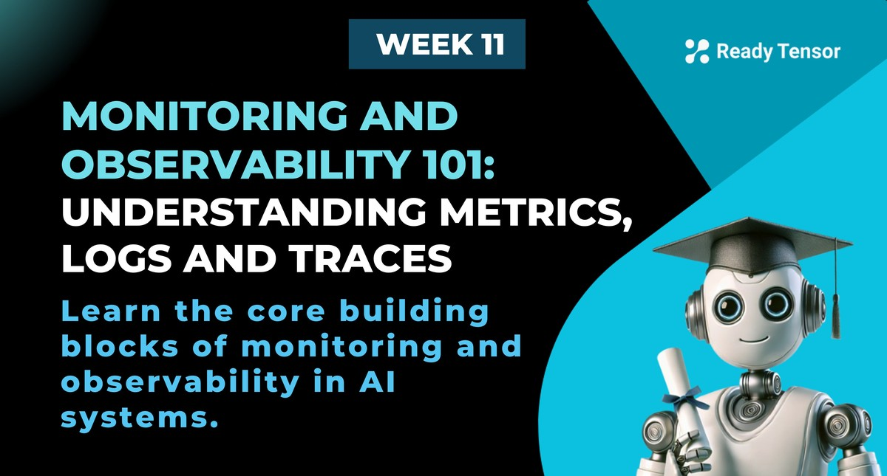
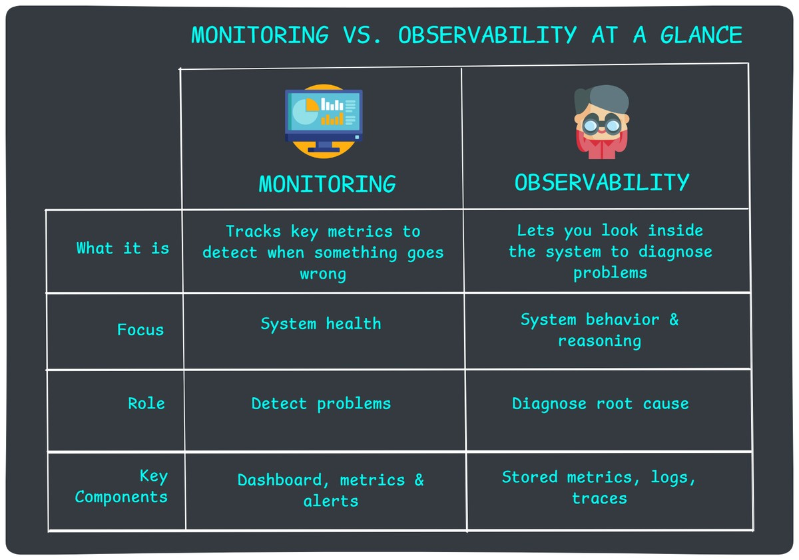
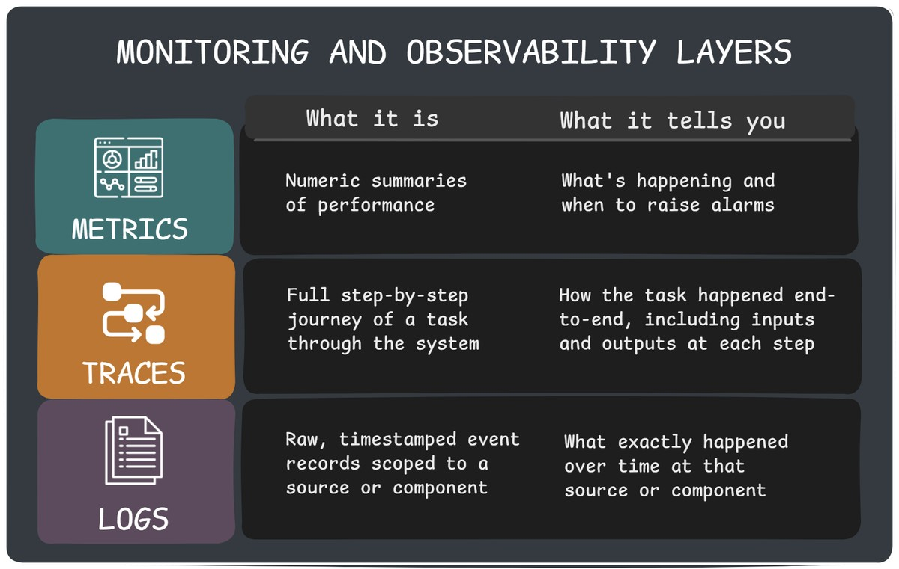

--DIVIDER--

---

[🏠 Home - All Lessons](https://app.readytensor.ai/hubs/ready_tensor_certifications)

[⬅️ Previous - Week 11 Preview](https://app.readytensor.ai/publications/dkWUcl9DJl6b)
[➡️ Next - What to Monitor & Observe](https://app.readytensor.ai/publications/McNh5g2RBFKq)

---

--DIVIDER--

# TL;DR

Before you can monitor or debug any AI system — agentic or not — you need to understand the basics. This lesson introduces the three pillars of observability (metrics, traces, and logs), clarifies how they differ from traditional monitoring, and sets the stage for building transparent, debuggable systems.

---

--DIVIDER--

# The Crisis No One Saw Coming

It's Tuesday morning. Six months ago, you deployed a customer service chatbot for your financial services company. The launch went smoothly, customers seemed happy, and your boss called it a "success story."

Then your phone rings.

> _"We need to talk. Now."_
> It's your manager, and they don’t sound happy.

Twenty minutes later, you're in a conference room with your manager, the VP of Customer Experience, and someone from Legal. The VP slides a printout across the table showing customer satisfaction scores for the past week.

They've **plummeted**.

> _"Look at these comments,"_ the VP says:

> _"The chatbot told me my account was closed when it wasn't."_ > _"It kept giving me the wrong routing number."_ > _"I asked about my loan status three times and got three different answers."_

Your stomach drops.

The Legal person clears their throat:
_"We've had twelve formal complaints this week. Some customers are threatening to switch banks."_

Your manager turns to you.

> _"What's going on? The system hasn't crashed. No error alerts. But customers say the bot was fine last month and now it's giving wrong answers."_

You stare at the feedback, mind racing. Everything shows green on your monitoring dashboard — uptime, response times, API calls. As far as you know, the system is running normally.

But clearly, something has gone **very wrong**.

> _"We need answers today,"_ the VP says.
> _"If we can't figure this out, we're pulling the chatbot offline."_

---

--DIVIDER--

# The Uncomfortable Reality: We’re Flying Blind

As you try to figure out where to even start investigating, the hard truth hits you:

- **When did this start?** You have no idea.
- **How many customers were affected?** No clue.
- **What kind of wrong answers?** You don’t have the logs or traces to tell.

You’re flying blind — and the clock is ticking.

Sound stressful?

Good. That’s the point.

Because this series is about preparing for exactly this moment — **before** it happens. We’ll show you how to monitor, log, and trace your agentic AI system so you’re never caught off guard again.

> **This is the first lesson in a four-part series on operational readiness for agentic AI systems.**
> Here’s the roadmap:

1.  **Foundations of Monitoring and Observability** — What these concepts really mean, and why they matter.
2.  **What to Monitor in Agentic AI** — The key failure modes and how to detect them using the right signals.
3.  **Tools for Observability** — How to choose, configure, and use tools for metrics, logs, and traces.
4.  **Troubleshooting in Production** — A step-by-step guide to finding and fixing real-world issues fast.

This first lesson lays the groundwork: what monitoring and observability really are, what they rely on, and why you need both.

> **Make your agentic AI system something you can see inside.**

Let’s get started.

---

--DIVIDER--

# What Monitoring and Observability Actually Mean

Let’s start by clearing up a foundational question:

**What’s the difference between monitoring and observability?**

They sound similar — and they’re deeply connected — but they serve different purposes.

--DIVIDER--

## Monitoring

Monitoring is about **watching system metrics** from the outside. It’s the layer that tells you something’s wrong — ideally, as soon as it happens. It tracks things like latency, error rates, and resource usage, and alerts you when these numbers cross certain thresholds.

> Think of monitoring as your **fire alarm system**. It doesn’t tell you where the fire started or why — just that it’s burning.

---

--DIVIDER--

## Observability

Observability is what lets you **look inside the system** and understand what’s actually going on. It includes **metrics, logs, and traces** — the raw material you need to piece together what happened, how, and why.

> If monitoring is the alarm, observability is the **security camera footage, the incident logbook, and the blueprint of the building**.

---

So Which One Do You Need?

**Both. Always.**

> Monitoring answers "what is happening?" while observability answers "why is it happening?"

---

--DIVIDER--

# The Three Layers of Monitoring and Observability

To monitor and observe your agentic system effectively, you need visibility across three layers:

---

## 1. Metrics – _The alarm system_

Numeric signals that help you detect problems quickly and measure performance over time.

Here are some common examples — especially relevant to LLM and agentic AI systems:

- Task completion rate
- Average latency
- Hallucination rate
- Guardrail violations (e.g. profanity, PII)
- Token usage per session
- Tool failure rate
- Fallback frequency

Metrics are great for triggering alerts and building dashboards. But they don’t explain _why_ something happened.

---

## 2. Traces – _The full journey_

A trace shows how a task moved through your system — step-by-step, node-by-node. It connects everything: user input → reasoning steps → tool invocations → output.

Use traces when you're debugging workflow-level issues — such as a user session that produced an incorrect or inconsistent result. They let you retrace the full path and identify where things went off course.

What traces typically include:

- Conversation flow across agents and tools
- Routing decisions
- Intermediate reasoning (e.g. “I chose this tool because…”)
- Timestamps and state transitions

Traces are your workflow debugger — use them to follow the full arc of reasoning and action across a session.

---

## 3. Logs – _The forensic evidence_

Logs are granular, timestamped records of everything that happened inside your system — including user inputs, agent decisions, tool calls, and outputs.
They are the **raw evidence** you turn to once you’ve narrowed down the issue using traces.

Use logs when you're investigating **a specific agent or tool** — for example, when a dashboard shows repeated failures for one tool, logs help you inspect what that tool received and returned.

What logs typically capture:

- Raw LLM inputs and outputs
- Tool call inputs and responses
- State mutations or error messages
- Safety filters triggered (e.g. profanity or PII)

Logs are your magnifying glass — use them to zoom in on what happened inside a specific node, tool, or step.

---

--DIVIDER--

:::info{title="Info"}

 <h3>💡 Terminology Cheat Sheet</h3>
 
 Want a quick reference for all the terms we’ve covered — and a few extra ones like SLIs, spans, and telemetry?
 Check out the **Glossary** in the Appendix at the end of this lesson.
 
 :::
 
 ---

--DIVIDER--

# What’s Next: Monitoring Agentic AI in the Real World

Now that you understand the foundations — metrics, traces, logs, and how they differ from traditional monitoring — it’s time to apply that lens to agentic AI.

In the next lesson, we’ll cover:

- Why agentic systems fail in ways traditional apps don’t
- The most common failure modes in production
- How to monitor for each one using the right mix of metrics, logs, and traces

> You’ll learn how to turn a vague complaint like “the bot is acting weird” into a fast, focused investigation.

Stay tuned — the real work begins in Lesson 2.

--DIVIDER--

---

[🏠 Home - All Lessons](https://app.readytensor.ai/hubs/ready_tensor_certifications)

[⬅️ Previous - Week 11 Preview](https://app.readytensor.ai/publications/dkWUcl9DJl6b)
[➡️ Next - What to Monitor & Observe](https://app.readytensor.ai/publications/McNh5g2RBFKq)

---

--DIVIDER--

# Appendix - Observability & Monitoring Glossary

**Metrics**
Numerical measurements tracked over time (e.g., response time, error rate, token usage). Think of them as your system's vital signs—they tell you _what_ is happening but not _why_.

**Logs**
Text records of events that happened in your system. In agentic AI, this includes user inputs, agent decisions, tool calls, and final outputs. Logs tell the story of what your system actually did.

**Traces**
A complete record of a request's journey through your system from start to finish. For agentic AI, a trace shows the full conversation flow: user question → agent reasoning → tool calls → final response.
Think of it as a forensic timeline of everything that happened.

**Spans**
Individual segments within a trace. Each span represents one operation (like "call LLM," "search vector database," or "invoke tool"). Spans can nest inside each other to show the full execution hierarchy.

**Instrumentation**
Adding code to your application to collect metrics, logs, and traces. Think of it as installing sensors throughout your system so you can see what's happening inside.

**Telemetry**
The data collected from your instrumentation—all the metrics, logs, and traces your system generates. It's the **raw data** that powers everything from dashboards to alerts.

**Monitoring**
Watching key metrics and getting alerted when they go outside normal ranges. Traditional monitoring focuses on system health (uptime, errors). Agentic monitoring also tracks behavior quality.

**Observability**
The ability to understand your system's internal state by examining its raw and processed outputs (metrics, logs, traces). If monitoring tells you _something is wrong_, observability helps you figure out _what_ and _why_.

**SLI (Service Level Indicator)**
A specific metric that measures some aspect of system performance — for example, “95th percentile LLM response time” or “percentage of valid JSON outputs.”

**SLO (Service Level Objective)**
A target value for an SLI that defines "good enough" performance. For example, "95% of responses should return in under 2 seconds" or "Tool calls should succeed 99.5% of the time."

**Dashboard**
A visual display of key metrics for tracking system health and behavior. In agentic AI, dashboards might show things like tool usage, LLM token counts, or fallback rates. Think of it as your system’s mission control panel.

**Alert/Alerting**
Automated notifications triggered when SLOs are violated or metrics cross thresholds. In agentic systems, this might include "hallucination rate above 5%" or "average reasoning steps exceeding 10."

---
