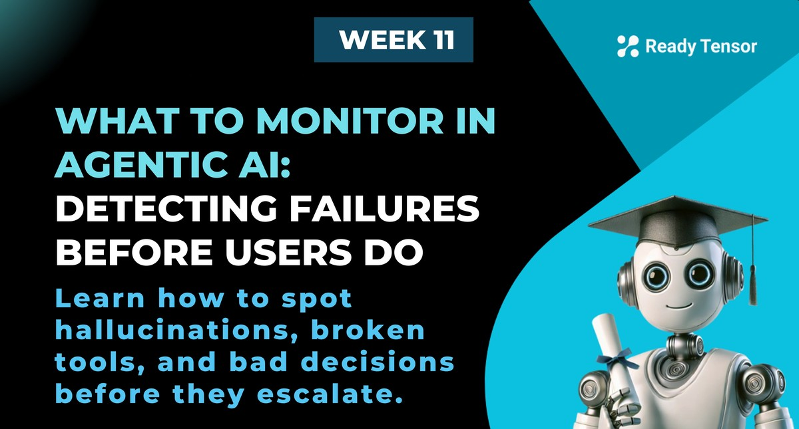
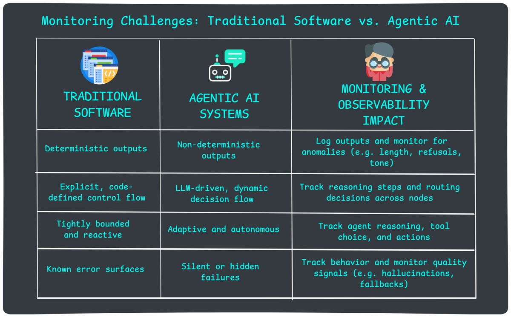

--DIVIDER--

---

[🏠 Home - All Lessons](https://app.readytensor.ai/hubs/ready_tensor_certifications)

[⬅️ Previous - Monitoring & Observability Foundations](https://app.readytensor.ai/publications/3p414r28A7UU)
[➡️ Next - Monitoring and Observability Tools](https://app.readytensor.ai/publications/z0GUbKAFMf9l)

---

--DIVIDER--

# TL;DR

**Agentic AI systems don’t crash — they misbehave.**
They hallucinate, misuse tools, take wrong paths, or return degraded results — all while appearing “healthy” to traditional monitoring. In this lesson, you’ll learn how to catch these silent failures by mapping common issues to the right metrics, logs, and traces.

---

--DIVIDER--

# How to Monitor Agentic AI (The Right Way)

In the last lesson, we learned the foundations of observability — metrics, logs, and traces — and how they work together to make complex systems debuggable.

Now it’s time to apply those tools to agentic AI — where things get trickier.

In this lesson, we’ll explore what makes monitoring these systems uniquely challenging. First, we’ll look at why agentic AI behaves differently — and often fails silently. Then we’ll break down the most common failure modes, what causes them, and how to detect them using the right observability signals.

You’ll learn how to map real-world issues — like hallucinations, tool misuse, and broken routing — to the exact metrics, logs, and traces you need. We’ll highlight the essential components to instrument from day one, and wrap up with common pitfalls to avoid when designing your monitoring strategy.

By the end, you’ll know what to watch, what to capture, and how to tell when your agent is quietly drifting off course.

---

--DIVIDER--

# Why Monitoring Agentic AI Is Different

In traditional software, monitoring focuses on uptime, latency, and explicit failures like crashes or timeouts.

Agentic AI systems are different. They don’t crash when they hallucinate, or raise errors when a tool misfires or a decision path goes wrong. Everything might appear to “work” — even when the user experience is broken.

Here’s how agentic AI challenges the assumptions of traditional monitoring — and what that means for production observability:

> **To monitor Agentic AI systems effectively, you need observability into behavior, not just system health.**

Now let’s break down what this actually means for your logging, metrics, and tracing setup.

---

--DIVIDER--

# Common Failure Modes in Agentic AI

In traditional systems, failures are loud: a crash, an exception, a 500 error. In agentic AI systems, failures are quiet. The system doesn’t stop — it just starts behaving badly.

That’s why it’s critical to understand what failure _looks like_ in agentic AI — not to your backend, but to your users.

These failures are subtle. They show up as bad answers, missing pieces, long delays, or unsafe responses. No red flashing lights. Just quiet degradation that erodes trust.

Let’s look at the five most common failure modes you’ll encounter — and why traditional monitoring won’t catch them.

---

## Hallucinations

> “The chatbot said my account was closed. It’s not.”

This is the most infamous kind of failure — when your AI confidently returns something false, fabricated, or off-topic.

It could be a made-up citation. An incorrect answer. Or just completely irrelevant reasoning.

Everything looks green from the system’s perspective. But the output is wrong — and no one catches it until a user complains.

**📊 Metrics to Track**

- Average faithfulness score (RAG response vs retrieved context)
- Average helpfulness score (does the answer directly address the user’s intent?)
- % of completions triggering fallback messages (e.g., “I don’t know”)
- % of abandoned sessions after first response (proxy for broken trust)
- % of completions downvoted by users (if feedback is enabled)

---

## Incomplete or Malformed Output

> “It gave me a summary, but the last section is missing.”
> “This JSON is invalid.”

In this case, the AI returns output — but it’s broken. Maybe a field is missing. Maybe the response format doesn’t match what your downstream code expects.

Sometimes the user sees it. Sometimes your frontend or API fails silently. Either way, it’s a failure.

**📊 Metrics to Track**

- % of outputs failing schema or format validation
- % of outputs below a minimum token or character threshold
- % of outputs ending mid-sentence or flagged as truncated
- Average interaction turns per session (as a proxy for user retry behavior)

---

## No Response or Latency Spike

> “It just… stopped.”
> “I waited 20 seconds and got nothing.”

Here, the system either stalls or takes far too long. The user might see a spinner, a timeout, or just give up.

Behind the scenes, this could be a tool hanging, an agent stuck in a loop, or a trace that never completes. But from the outside? It just feels like the system vanished.

**📊 Metrics to Track**

- % of sessions exceeding latency threshold (e.g., 5s, 10s)
- % of sessions with no output returned
- Average response time per component (LLM, tool, total session)
- % abandoned sessions (proxy for user frustration)

---

## Guardrail Violations

> “Why did the bot tell the user to lie on their tax form?”
> “It exposed a full name and email.”

This is where your assistant crosses the line — ethically, legally, or reputationally.

These failures include unsafe content (e.g., PII, hate speech), tone issues (e.g., off-brand responses), or refusals to follow safety instructions. They might be rare — but when they happen, they’re costly.

**📊 Metrics to Track**

- % of completions flagged by safety filters (e.g., PII, profanity, disallowed topics)
- % of flagged responses escalated or manually moderated
- % of completions with LLM refusal response (e.g., “Sorry, I can’t help with that”)

---

## Incorrect Actions

> “It emailed the wrong document.”
> “It searched when it was supposed to summarize.”

These failures happen when the AI **takes the wrong step** — calls the wrong tool, sends the wrong message, or routes a task to the wrong agent.

The scary part? This often looks correct from the outside — but it’s not what was intended. Unless you're tracing decisions, you may never know it happened.

**📊 Metrics to Track**

- % of tool calls that return known-invalid or error responses
- % of sessions hitting fallback or escalation flows
- Average turns per session (or: Turns to success)

---

--DIVIDER--

# What Causes Agentic Failures Under the Hood

Agentic AI systems rarely fail outright. Instead, they degrade — often quietly — due to subtle shifts in the environment, tools, or model behavior.

Maybe the system was working fine… until a new document was added. Or an API changed. Or the prompt crept past the token limit.

These aren’t abstract model flaws — they’re concrete, observable issues. And if you instrument your system well, you can catch them before they cascade.

Let’s look at the most common runtime causes — and how to detect them with metrics, logs, and traces.

---

## Retrieval Failure

> Your retrieval step returns nothing… or worse, the wrong context.

This is the root cause behind many hallucinations. The index may be stale, embedding quality degraded, or corrupted due to data drift.

From the model’s point of view? No useful grounding = guess time.

**📊 Metrics to Track**

- % of queries with empty or null results
- Average similarity score of top-k results
- % of sessions with low faithfulness score (RAG eval)

**📝 Logs / Traces to Capture**

- Raw retrieval query and top-k results (with scores)
- Document sources and metadata (e.g., source, chunk ID, timestamp)
- Retrieval step latency and embedding model version

---

## Tool Call Failure

> A tool goes down or misbehaves — but the agent continues anyway.

Maybe the tool timed out. Maybe the schema changed. Maybe you got rate-limited and defaulted to stale data.

When tools fail silently, they break the downstream logic — and the user gets a bad or partial result.

**📊 Metrics to Track**

- % of tool calls returning error or timeout
- Tool latency and failure distribution by type
- % of sessions invoking fallback flows after tool step

**📝 Logs / Traces to Capture**

- Tool name, input args, and raw response
- Error message or status code
- Retry count and timeout settings (if any)

---

## Invalid or Corrupted State

> One node sends broken state. The next makes a broken decision.

In agentic systems, each node inherits context. If that context gets corrupted — missing keys, bad formats, wrong assumptions — your agent may “work” while misfiring completely.

**📊 Metrics to Track**

- % of sessions where state validation fails
- % of sessions with fallback triggered after routing/tool mismatch
- % of LLM completions that contain invalid or missing required fields

**📝 Logs / Traces to Capture**

- Full state object at handoff between nodes
- Schema used (and version)
- Any diffs from expected keys or structures

---

## Prompt Token Limit Hit

> Everything seems fine… until something gets clipped.

If your prompt (input + context) or output exceeds model limits, the result may be incomplete, garbled, or cut off mid-thought — with no visible error.

**📊 Metrics to Track**

- % of prompts near or above model token limit
- % of completions flagged as truncated
- Avg prompt size over time, per use case

**📝 Logs / Traces to Capture**

- Total input + output token count per call
- Prompt content with metadata (truncated? padded?)
- Model context window limit (model-dependent)

---

## LLM Output Constraint Violation

> You asked for structured output. You got a poem.

When LLMs violate output structure — JSON, markdown, numbered list — the failure often isn't caught until a downstream system chokes.

**📊 Metrics to Track**

- % of completions failing structure or schema validation
- % of sessions where retry logic was triggered due to bad format

**📝 Logs / Traces to Capture**

- Raw LLM output (with response format type expected)
- Validation pass/fail and error message
- Prompt template used (with constraints, instructions)

---

--DIVIDER--

# Common Pitfalls in Monitoring and Observability Design

Even with good tools, observability can fail if the design is sloppy. Watch out for these common mistakes:

---

**1. Irrelevant Metrics**
Start with default metrics from your tool, but don’t stop there. Ask: _Does this metric actually tell me something about user experience or system health?_ If not, drop it or reframe it.

---

**2. Metrics Overload**
Don’t turn your dashboard into an airplane cockpit. Focus on 10–15 key metrics that matter. Store others for deep dives — but keep them off your main dashboards and reports, or people will tune them out.

---

**3. Alert Fatigue**
Every alert you add “just in case” increases the odds of real ones getting ignored. Set thresholds thoughtfully. If your team doesn’t take alerts seriously, your system isn’t observable — it’s noisy.

---

**4. Inadequate Tracing**
You can be selective about metrics, but never skimp on traces. Always log LLM inputs and outputs, tool calls, and key decision points — even in production. Crises never happen while you’re watching the logs.

---

**5. Garbage Tracking**
Verbose logs are fine — cluttered ones aren’t. Remove filler, add structure, and make sure critical context (like session IDs or agent decisions) is easy to find when you need it most.

---

--DIVIDER--

# Don’t Stop at System Metrics

System-level telemetry is critical — but it’s not the whole story. Sometimes your observability stack says everything’s green, and your customers still hate the experience.

That’s where **business signals** come in.

Track things like:

- **Customer satisfaction scores**
- **Helpfulness ratings** (thumbs up/down)
- **Escalation rates** or **agent handoffs**
- **Repeat queries** or **user churn**
- **Survey feedback and complaint keywords**

These metrics may not point to the _cause_, but they tell you something’s wrong — especially when system metrics stay silent. Think of them as your **user-driven smoke detector**.

If your fallback rate is steady but satisfaction scores drop, that’s still a red flag. Build dashboards that show these trends side by side with system health.

Let your users speak through the data — and listen.

---

--DIVIDER--

# Wrap-Up: Monitoring & Observability as an Insurance Policy

You don’t buy insurance because you expect disaster — you buy it so you’re covered when it happens.

Monitoring and observability serve the same role in agentic AI systems.

You hope your chatbot never hallucinates. You hope your routing logic never breaks. You hope your tools don’t silently fail. But hope isn’t a strategy.

Instrumentation is your insurance. It won’t stop failure — but it’ll help you catch it early, understand it fast, and recover with confidence.

Next up: an overview of the best tools for monitoring and observability in agentic AI. We’ll look at how to choose the right ones.

--DIVIDER--

---

[🏠 Home - All Lessons](https://app.readytensor.ai/hubs/ready_tensor_certifications)

[⬅️ Previous - Monitoring & Observability Foundations](https://app.readytensor.ai/publications/3p414r28A7UU)
[➡️ Next - Monitoring and Observability Tools](https://app.readytensor.ai/publications/z0GUbKAFMf9l)

---
