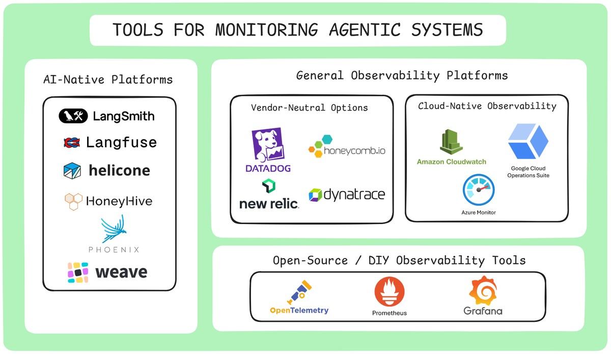

--DIVIDER--

---

[🏠 Home - All Lessons](https://app.readytensor.ai/hubs/ready_tensor_certifications)

[⬅️ Previous - What to Monitor & Observe](https://app.readytensor.ai/publications/McNh5g2RBFKq)
[➡️ Next - Troubleshooting Failures in Agentic AI](https://app.readytensor.ai/publications/6qmc6P1CWNGY)

---

--DIVIDER--

# TL;DR

Monitoring and observability tools are essential for understanding, debugging, and improving agentic AI systems in production. This lesson walks you through the major categories — AI-native platforms, hosted observability stacks, and open-source tools — and helps you pick the right one based on your needs, infrastructure, and compliance requirements. Whether you're using LangSmith or building with OpenTelemetry, you'll learn how to gain visibility into your system’s behavior, not just its uptime.

---

--DIVIDER--

# Making Monitoring Real

In the last lesson, you learned what to monitor in agentic AI systems — from hallucinations and incomplete outputs to silent failures caused by tool errors, retrieval issues, or state corruption. You now know how to track these failures using the right mix of metrics, logs, and traces.

But knowing _what_ to monitor is only half the battle.

The next challenge is figuring out **how** to monitor it — and with **which tools**.

This lesson introduces the tools that bring your observability plans to life. We’ll look at which platforms offer deep tracing, which ones plug cleanly into LLM workflows, and how to balance speed, control, and compliance as you scale.

Let’s dive in.

---

--DIVIDER--

# Tools for Monitoring Agentic Systems

There’s no single “best” tool for monitoring agentic systems — but most setups fall into three categories. Your choice depends on how tightly you want to integrate, how much control you need, and whether you prefer managed platforms or custom setups.

Just like agentic AI breaks traditional monitoring assumptions, it also reshapes the tooling landscape. You're not just logging API failures — you're tracing decisions, inspecting prompts, and catching issues like hallucinations, tool misfires, or safety violations.

That’s why tools for agentic AI fall into three broad buckets:

--DIVIDER--

--DIVIDER--

## 1. AI-Native Platforms

These platforms are purpose-built for LLM and agentic systems. They automatically log prompts, responses, tool usage, traces, and metadata — giving you a high-resolution view into how your agent is behaving.

**Examples**:

- **LangSmith** – Seamless integration with LangChain and LangGraph. Ideal for tracing multi-step agent workflows, inspecting tool calls, and debugging prompts
- **Langfuse** – Open-source and framework-agnostic. Offers full observability across LLM apps, including session-level dashboards and prompt versioning.
- **Helicone** – Acts as a proxy layer for OpenAI and Anthropic APIs. Tracks token usage, latency, and costs with minimal setup.
- **HoneyHive** – Collaborative analytics and evaluation tools for LLM apps. Emphasizes team workflows, user feedback, and qualitative review.
- **Weights & Biases (W&B Weave)** – An open-source framework for tracking LLM calls and application logic, designed to help debug AI applications in production.

These tools are great if you want quick, meaningful visibility without building custom infrastructure.

**But keep in mind:**

- Some are tightly coupled to specific frameworks or APIs.
- Hosted solutions may raise privacy or compliance concerns.
- Deep customization (like custom pipelines or enterprise-grade access control) may require workarounds or higher-tier plans.

If you're okay with managed services and want fast insights into how your agentic system is performing, this category is a strong starting point.

---

--DIVIDER--

 <h3>📹 LangSmith in Action: Visual Debugging for Agentic Systems</h3>
 
 If you haven’t seen it yet, our Week 5, Lesson 3 features a hands-on walkthrough of LangSmith — one of the most powerful tracing tools available for agentic AI systems. 
 
 :::youtube[Title]{#AqoqxkGy9NY}
 
 In the video, we use LangSmith to inspect an actual agent built in the program. You’ll see how it lets you:
 - Trace every LLM call, tool invocation, and routing decision
 - Visualize state transitions and branching paths through LangGraph
 - Replay entire sessions to quickly identify where things went wrong
 
 If you're evaluating AI-native monitoring platforms, this demo gives a clear picture of what deep agent observability looks like in practice.
 
 ---

--DIVIDER--

## 2. Hosted Observability Platforms (Adaptable for AI/ML)

These platforms weren’t purpose-built for LLMs — but they’re powerful, scalable, and already battle-tested in traditional software systems. You can track custom metrics, emit logs and traces, and tie AI system health to your broader infrastructure.

 <h3>Vendor-Neutral Options</h3>
 
 **Examples**: Datadog, New Relic, Honeycomb
 
 These are vendor-managed tools with rich UIs, prebuilt dashboards, and OpenTelemetry support. Great for fast setup, enterprise SLAs, and integrating AI observability into broader system dashboards.
 
 **Pros**: Quick to deploy, polished UX, alerting and correlation built in
 **Cons**: Less opinionated about agent workflows. You’ll need to define your own trace schemas and semantic metrics.
 
 ---

--DIVIDER--

 <h2>Cloud-Native Observability</h2>
 
 If you're running your agents in AWS, GCP, or Azure, their native tools offer tight integration and low setup friction:
 
 - **AWS CloudWatch**
 - **Google Cloud Operations Suite (formerly Stackdriver)**
 - **Azure Monitor**
 
 These support logs, metrics, and traces — and work well with **OpenTelemetry** for custom agentic data.
 
 **Pros**: Built-in with your cloud, secure by default, and great for cost observability.
 **Cons**: Often minimal UI for deep debugging, and not tailored to LLM-specific failure modes.
 
 ---

--DIVIDER--

## 3. Self-Hosted Open Source Stack

Prefer control over convenience? Build your own observability stack using open-source tools. These solutions give you flexibility, data ownership, and customization — but require more engineering investment.

 <h3>🛠️ Core Tools</h3>
 
 - **OpenTelemetry** – Standard framework for emitting logs, traces, and metrics
 - **Prometheus** – Time-series database for metrics collection and alerting
 - **Grafana** – Visualization and dashboarding for metrics and traces
 
 > This stack is ideal for mature teams or high-compliance environments where control, privacy, and customization matter.
 
 > **Pros**: Fully customizable, open-source, no vendor lock-in
 > **Cons**: Requires setup, schema design, infra maintenance, and observability expertise
 
 ---
 
 The platforms and tools listed above are certainly not exhaustive, but they represent the most common approaches to monitoring and observability in agentic AI systems. The right choice depends on your specific needs, existing infrastructure, and team expertise.
 
 ---

--DIVIDER--

# Choosing the Right Observability Tool

Selecting the right monitoring and observability tool depends on your system’s complexity, compliance needs, and operational priorities. Here are key factors to guide your decision:

- **Visibility & Traceability**: Can the tool help you follow each agent decision, log every action, and understand _why_ it happened?
- **Monitoring & Alerting**: Does the tool support real-time metrics, anomaly detection, and customizable alerts?
- **LLM Cost Tracking**: Can it help you track your LLM spend — such as high-token prompts, retries, or unnecessary steps?
- **Integration Fit**: Does it integrate with your current stack — and support open standards like OpenTelemetry?
- **Security & Compliance**: Does your data need to be encrypted and stay on-prem or in a private cloud? Do you require full audit trails for compliance with SOC 2, GDPR, or HIPAA?
- **Scalability**: Can it grow with your AI workloads and adapt to new infrastructure or workflows?
- **Vendor/Tool Pricing**: Is the tool’s cost structure aligned with your usage patterns and budget?
- **Vendor Maturity**: Does the vendor offer strong support, domain expertise, and free trials or PoCs?

> 💡 If you're just getting started, prioritize visibility and alerting — then layer in compliance, cost controls, and scale as your system matures.

---

--DIVIDER--

# Final Takeaway: What Matters Isn’t the Tool — It’s What You See

It’s easy to get caught up comparing dashboards, pricing tiers, or which tool integrates best with your stack. But at the end of the day, your observability stack isn’t about logos — it’s about **insight**.

Can you trace what your system did — and why? Can you catch failures before users do — even if nothing crashes?

That’s what separates reliable systems from fragile ones.

> In production, success often hinges on your ability to track what's happening — and explain why.

---

--DIVIDER--

---

[🏠 Home - All Lessons](https://app.readytensor.ai/hubs/ready_tensor_certifications)

[⬅️ Previous - What to Monitor & Observe](https://app.readytensor.ai/publications/McNh5g2RBFKq)
[➡️ Next - Troubleshooting Failures in Agentic AI](https://app.readytensor.ai/publications/6qmc6P1CWNGY)

---
