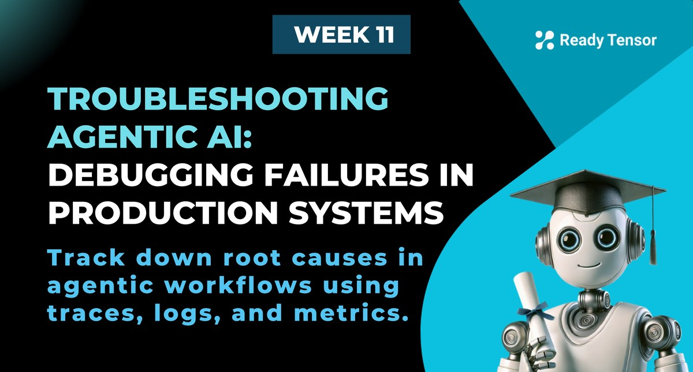

--DIVIDER--

---

[🏠 Home - All Lessons](https://app.readytensor.ai/hubs/ready_tensor_certifications)

[⬅️ Previous - Monitoring & Observability](https://app.readytensor.ai/publications/z0GUbKAFMf9l)

---

--DIVIDER--

# TL;DR

Your agentic system isn’t crashing. But users are frustrated, outputs are weird, and nothing obvious is broken.

Welcome to the most common (and most frustrating) kind of failure in production AI: the silent drift, the hidden bug, the slow collapse of behavior quality.

In this lesson, you will learn how to diagnose these failures like a pro - using traces, logs, and metrics to trace symptoms back to root causes. We’ll walk through real examples, then abstract them into a repeatable troubleshooting process you can apply to any system.

---

--DIVIDER--

# The Chatbot Crisis, Revisited 🚨

Let’s rewind to that financial services chatbot we met in Lesson 1a.

At first, everything looked fine. Uptime was 100%. Latency steady. No error alerts.

But then, quietly, things started going wrong.

- Customers were getting wrong account info.
- Tool outputs were missing fields.
- Some responses just stopped halfway.

And by the time the VP of Customer Experience walked into that meeting with a printout of angry feedback, it was already too late.

But what if we could catch it earlier?

---

--DIVIDER--

# What Great Observability Looks Like

Here’s how that same story plays out **with** proper monitoring and observability.

It’s Monday morning. You haven’t had coffee yet. But your dashboard is already telling a different story:

**🔴 Faithfulness scores** on retrieval answers have dropped 20%.
**🔴 Fallback rates** are spiking — the retrieval agent is bailing more often.
**🔴 Tool failure rates** jumped for one critical integration.
**🔴 Thumbs-downs** from users are trending up.

Nothing has crashed. But clearly, something’s not right.

You are seeing signs of trouble — and now it’s time to investigate.

---

--DIVIDER--

# Case File #1: The Disappearing Documents

The first clue comes from your **retrieval agent**.

Its faithfulness scores have been drifting lower over the past few days. Not a dramatic cliff — but enough to notice.

You pull a few traces. And that’s when you spot it:

- For several queries, the retrieval step returned nothing at all.
- For others, it returned outdated chunks — nothing recent.

You flip to the logs for the ingestion pipeline. And there it is.

```txt
[ingest_worker] Skipped 17 documents – unsupported file type (.txt)
```

Someone on the content team started uploading `.txt` files instead of `.md`, and the ingestion script was silently ignoring them.

✅ You fix the pipeline to support both formats.
🔔 You add an alert for skipped documents in future.
📈 Retrieval scores begin to recover by the next day.

---

--DIVIDER--

# Case File #2: The Vanishing Tool

This one’s about tool failures that derail workflows mid-execution.

You notice a spike in loop exits. Traces show agents retrying a tool call, then falling back. Logs reveal a string of 502 errors.

You trace the failures to a single integration — a third-party document generator tool.

Then you check the service logs:

```txt
[error] API key expired – unauthorized
```

Ah. That explains it.

✅ You rotate the key.
🔐 You enable automatic expiration reminders.
🛠️ You build retry + backup logic into the tool config.

And just like that — your agents stop quitting halfway through.

---

--DIVIDER--

**🧱 Seeing the Pattern**

By now, a pattern should be clear.

Good observability doesn’t just surface what’s wrong. It shows you:

- **Where** the system broke.
- **Why** it broke.
- And sometimes, even **when** the break started.

But to make that power usable, you need a process. Something you can reach for when things go sideways.

So here’s the playbook.

---

--DIVIDER--

# The Root Cause Diagnosis Playbook

Let’s step back from the examples and distill what you’ve seen into a reusable framework. This is the process we recommend whenever you are debugging a flaky tool or tracing a weird drop in quality.

---

--DIVIDER--

## 1. Spot the Problem

Most agentic failures don’t announce themselves. They sneak in — slow drifts, small regressions, strange inconsistencies.

That’s why step one is all about noticing the **early signals**:

- Spikes in fallback usage or loop exits
- Drops in key quality metrics like faithfulness or output structure
- Lagging sessions or rising abandonment
- Negative feedback — thumbs-downs, retries, vague user complaints

Ask yourself:

- Is this affecting everyone or just certain types of queries?
- Is it happening consistently, or only under specific conditions?
- Did anything change recently — prompts, tools, deployment?

Think of this as scoping the investigation. You’re narrowing the search area before going deeper.

---

--DIVIDER--

## 2. Trace the Flow

Now that you know something’s off, it’s time to walk the path.

Start with a few representative failure sessions. Pull full traces — from user input to final output — and follow the steps:

- What decisions were made?
- Which tools were called?
- What state was passed from node to node?

Compare broken sessions to successful ones. Where do they diverge? Did a step get skipped? Did the wrong tool get chosen? Was context missing?

Traces show you **what happened** — step by step. They help you spot weird detours, logic gaps, or silent failures.

---

--DIVIDER--

## 3. Dive into Logs

Once you’ve identified the suspicious moment in the trace, zoom in further.

Logs give you the **raw materials**: the inputs, outputs, and internal state for every node and tool.

Look for:

- Unexpected LLM outputs (missing fields, wrong format, hallucinations)
- Tool call responses — including silent errors or empty returns
- Schema mismatches or context corruption
- Strange system messages, error codes, retries

This is where you usually find your “aha” moment — the exact line of text or payload that explains everything.

---

--DIVIDER--

## 4. Patch, Verify, Monitor

By now, you’ve likely identified the root cause. But don’t rush to deploy.

Instead:

- Patch the issue in dev or staging
- Re-run the failure cases — make sure they now succeed
- Sanity check surrounding flows to avoid regressions
- Deploy carefully
- Monitor closely post-deploy to confirm it’s fixed

This step isn’t glamorous. But it’s what turns a fix into a **safe recovery** — and keeps you from replacing one bug with another.

---

--DIVIDER--

## 5. Contain the Impact (While You Fix the Root Cause)

Not every failure can be fixed immediately. Sometimes you need to **stabilize the system first**, then work on a longer-term fix.

This is your short-term damage control plan:

- **Let degraded output continue — temporarily.**
  Only if the impact is minor and the failure is visible or obvious. Set a time limit, and monitor closely.

- **Disable the failing agent or tool.**
  Better to skip a feature than confuse users with broken responses.

- **Roll back to a known good version.**
  Especially if a recent deployment caused the issue. Stability first — you can investigate after rollback.

- **Always communicate with users or stakeholders.**
  Quiet failures erode trust. A simple heads-up goes a long way.

The goal here isn’t to fix the system immediately — it’s to **contain the blast radius** while you buy yourself time.

---

--DIVIDER--

# Beyond Debugging: Culture Matters

None of this works without the right mindset. Here’s how to build a culture that catches and fixes issues early — without burning out your team:

**✅ Blameless Debugging**  
 Every failure is a chance to improve the system — not an excuse to assign blame.

**📜 Log Prompt Versions**  
 Version and log your prompts, especially in LLM chains. You’ll thank yourself when reproducing bugs.

**📚 Build a Knowledge Base**  
 Document weird bugs and edge cases. Over time, this becomes your team’s second brain.

**🛎️ Reward Early Detection**  
 Don’t just applaud firefighting. Recognize those who spot issues before they become crises.

**🔧 Treat Observability as a Feature**  
 Logging and tracing aren’t “ops work” — they’re part of your core system design.

---

--DIVIDER--

# Final Takeaway

Most failures in agentic systems aren’t loud. They’re quiet shifts: a bit less helpful, a bit more inconsistent, a little slower to respond.

Left unchecked, these small issues add up — and slowly erode user trust.

The good news? You have the tools to catch them early.

Your job is to monitor carefully, trace thoughtfully, and resolve issues with confidence, before they escalate.

> A well-instrumented system doesn’t just run, it tells you when something’s off.

In the next lesson, we’ll shift gears to explore **data privacy and compliance** - because not all risks are technical, and responsible AI means thinking beyond the code.

--DIVIDER--

---

[🏠 Home - All Lessons](https://app.readytensor.ai/hubs/ready_tensor_certifications)

[⬅️ Previous - Monitoring and Observability Tools](https://app.readytensor.ai/publications/z0GUbKAFMf9l)

---
