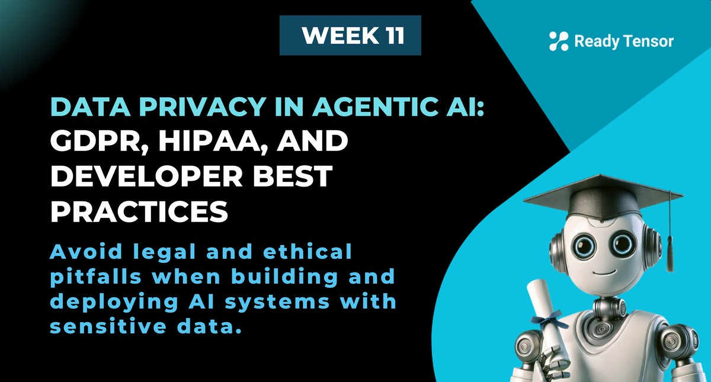
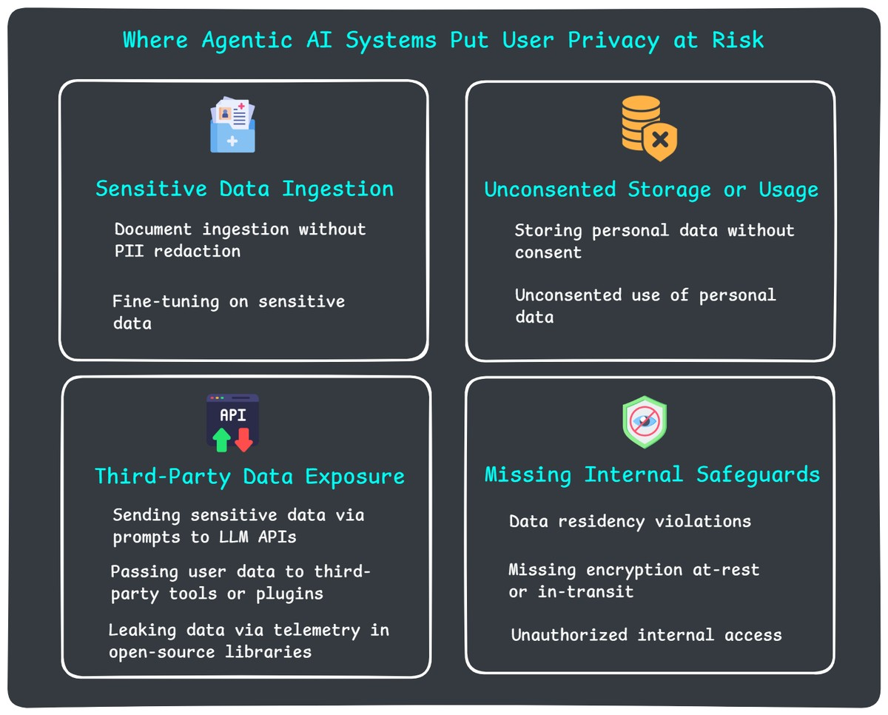

--DIVIDER--

---

[🏠 Home - All Lessons](https://app.readytensor.ai/hubs/ready_tensor_certifications)

[⬅️ Previous - Troubleshooting Failures in Agentic AI](https://app.readytensor.ai/publications/6qmc6P1CWNGY)

---

--DIVIDER--

# TL;DR

Agentic AI systems often handle personal or sensitive data, sometimes without developers realizing the risks. This lesson covers the key privacy and compliance principles every developer should understand to build safe, trustworthy systems. You’ll learn how frameworks like GDPR and HIPAA apply across design, deployment, memory, and monitoring.

---

--DIVIDER--

# Data Privacy: The Hidden Risk in Agentic AI Systems

Let’s say you just built a smart assistant for hospital staff — it answers questions using internal care protocols and documentation. It uses RAG to retrieve relevant text, feeds it to an LLM, logs the input and output, and stores the conversation history so clinicians can pick up where they left off.

Everything works smoothly. Nurses love it. It saves time and reduces errors.

Now imagine this: one of the documents it ingests includes a real patient case study — with full names, diagnoses, and treatment history. A nurse asks, “What’s the recommended protocol for post-op infections?” and your assistant, trying to be helpful, **quotes directly from that case study — including the patient’s full name and medical condition**.

Your bot just shared sensitive patient information.

No alarms go off. No one notices. But you just:

- Violated **HIPAA** by exposing protected health information (PHI)
- Possibly violated **GDPR** if any of that data belongs to an EU citizen
- Broke your own institution’s internal data handling policies

All without ever writing code to “handle patient data.”

---

--DIVIDER--

This is why data privacy and compliance concerns aren’t just for lawyers or security teams anymore — they’re a developer responsibility too.

You might think this only applies to healthcare, finance, or other tightly regulated industries.
But that’s not the case. Any agentic AI system that handles user input — even a simple chatbot — can easily cross into sensitive data territory.

The moment your system sees names, email addresses, phone numbers, physical addresses, Slack messages, or anything remotely personal, you’re in the domain of data protection laws. That means you need to understand the risks — and build with care.

You don’t need to memorize legal frameworks or read 200 pages of GDPR.
But you do need to recognize when personal data is in play — and know how to handle it safely, responsibly, and with respect for the privacy of the people behind it.

Let’s break down what responsible data handling actually looks like — and how to make it a core part of how you design and deploy agentic systems.

---

--DIVIDER--

# What GDPR, HIPAA, and SOC 2 Expect From You

Let’s be honest: most developers don’t read privacy laws — and that’s okay. You’re not expected to become a legal expert. But you _are_ expected to build systems that don’t break those laws, even by accident.

The good news? These frameworks actually care about a few clear, consistent things. If you understand the basics, you can build in the right direction from the start.

---

--DIVIDER--

## **GDPR**

**(General Data Protection Regulation — European Union)**

GDPR applies if you’re handling personal data about anyone in the EU — even if your system is based elsewhere. And “personal data” is broad: names, emails, IP addresses, location info, job titles, document uploads, and more.

**Key principles to know:**

- **Consent:** You need a legal basis to collect and process data — and often, that means informed consent.
- **Data Minimization:** Only collect what you need. Don’t log everything just because you can.
- **Right to Access & Deletion:** Users can request to see or delete their data — and your system needs to support that.
- **Data Residency:** Some data can’t legally leave certain countries or regions.

GDPR doesn’t care if you’re “just prototyping.” If you’re collecting real user input, it applies.

> _A chatbot that stores conversation history needs consent and deletion capability._

---

--DIVIDER--

## **HIPAA**

**(Health Insurance Portability and Accountability Act — U.S.)**

HIPAA applies to healthcare providers and any software system that handles **protected health information (PHI)**. If your agent sees anything about a patient’s health status, diagnosis, treatment, or medical history — even in a casual chat — you’re in HIPAA territory.

**What matters under HIPAA:**

- **Access Control:** Only authorized users should see PHI.
- **Audit Trails:** You need logs that show who accessed what — but those logs can’t leak PHI themselves.
- **Data Safeguards:** Encryption, secure storage, and privacy-preserving defaults are mandatory.
- **Disclosure Rules:** You can’t send PHI to third-party tools or APIs unless they have proper agreements in place (like a Business Associate Agreement, or BAA).

HIPAA violations can lead to serious consequences — for your users _and_ your organization.

> _Logging 'User asked about chest pain symptoms' could be a PHI exposure if it’s linked to a specific patient._

---

--DIVIDER--

## **SOC 2**

**(System and Organization Controls — U.S. auditing framework)**

Unlike GDPR or HIPAA, **SOC 2 isn’t a law** — it’s an auditing standard that companies use to prove their systems are trustworthy. It’s especially relevant for startups working with enterprise customers.

SOC 2 focuses on five trust principles:

1.  **Security** – Are your systems protected from unauthorized access?
2.  **Availability** – Can your systems perform reliably?
3.  **Processing Integrity** – Do they behave as expected?
4.  **Confidentiality** – Is sensitive data kept private?
5.  **Privacy** – Is personal information handled appropriately?

For agentic systems, SOC 2 often affects **how you store logs, protect user data, and manage third-party services**. If your system is being used in a commercial setting, expect SOC 2 requirements to come up — especially during procurement or security reviews.

> _Most large enterprises won’t use your system unless you can show it meets SOC 2 standards._

---

--DIVIDER--

## So What Do They All Have in Common?

They want systems that handle user data:

- **With consent**
- **With restraint**
- **With visibility and control**
- **With strong safeguards**
- **And with respect for the people behind the data**

You don’t need to check every legal box on your own.
But you do need to **design like someone will ask hard questions later** — because if your system succeeds, someone eventually will.

---

--DIVIDER--

:::info{title="Info"}

 <h2> 💡 Terminology Cheat Sheet </h2>
 
 Need a quick reference? See the Glossary at the end of this lesson for clear definitions of common privacy and compliance terms.
 :::

--DIVIDER--

# Where Agentic Systems Leak Data (Without You Realizing It)

Most privacy violations in agentic systems aren’t the result of bad intentions — they’re accidents. You’re not trying to build something unethical. You’re just trying to build something that works.

But when AI systems operate with memory, autonomy, tool access, and logging, it becomes surprisingly easy to cross the line — sometimes without even realizing it.

Here are some of the most common ways developers accidentally expose sensitive data when working with agentic systems.

---

--DIVIDER--

## 🔹 1. Sensitive Data Ingestion

**Document ingestion without redaction**
Retrieval-augmented generation (RAG) systems depend on document ingestion. But if those documents include resumes, medical notes, HR records, or internal messages — and you don’t sanitize them — your agent might later quote that data back to users who shouldn’t see it.

**Fine-tuning on sensitive data**
If you train or fine-tune an LLM on internal documents that include private information, that data may become part of the model’s memory. Even if it only appears in a handful of training examples, it could surface later in completions — and you may have no way to remove it.

---

--DIVIDER--

## 🔹 2. Unconsented Storage or Usage

**Storing chat history or state without consent**
Persistent memory makes agents more helpful. But storing personal inputs — even if you only show them to the same user later — can be problematic if you haven’t clearly disclosed it or allowed users to opt out.

**Unconsented use of personal data**
Using someone’s data without consent — whether to build memory, populate knowledge graphs, or drive downstream actions — is still a privacy risk. Personal data should only be reused with clear permission and clear purpose.

---

--DIVIDER--

## 🔹 3. Third-Party Data Exposure

**Sending sensitive data via prompts to LLM APIs**
When you call an API like OpenAI or Anthropic, and your prompt includes names, emails, or diagnoses, you may be violating privacy laws if those services don’t offer proper agreements (like HIPAA BAAs or GDPR DPAs) — or if you’re not using the right configuration.

**Passing user data to third-party tools or plugins**
Sending prompts, traces, retrieved documents, or memory to external tools for processing, monitoring or enhancement can unintentionally leak sensitive information — especially if those services don’t support redaction, encryption, or region-specific hosting.

**Leaking data via telemetry in open-source libraries**
Even some helpful libraries include background logging or analytics. Tools like `wandb`, `guardrails`, or unconfigured observability SDKs may send metadata to their own cloud by default. If that metadata contains sensitive fields, you're on the hook.

---

--DIVIDER--

## 🔹 4. Missing Internal Safeguards

**Data residency violations**
Some laws — like GDPR — require user data to stay within specific regions. If your system stores EU user data in U.S.-based servers (including logs, backups, or vector DBs), you may be out of compliance even if the data is encrypted.

**Missing encryption**
If sensitive data isn’t encrypted during transmission or while at rest, you may be violating frameworks like HIPAA or SOC 2. And in the event of a breach, unencrypted data means far more liability.

**Unauthorized internal access**
Even if your data stays within your system, that’s not enough. If logs or traces include things like credit card numbers, phone numbers, or medical info — and anyone on your team can access them — that’s a privacy failure. Access controls, audit trails, and data segregation matter.

---

--DIVIDER--

# How to Build Privacy-Aware Agentic Systems

You don’t need to build like a bank — but you do need to build like someone might ask tough questions later.

Agentic systems can easily end up storing, surfacing, or transmitting personal data in ways that users never expected. The best way to stay safe? Bake privacy into the system — from day one.

Here’s how to do that without going overboard.

---

--DIVIDER--

## **Minimize by Default**

Don’t store more than you need. Every extra log, document, or memory entry is a potential liability.

- Only persist memory if it directly improves user experience.
- Avoid logging raw prompts, retrieved documents, or full user inputs.
- If you do log, redact or pseudonymize sensitive fields before they’re stored.

> A system that collects less creates fewer problems — and fewer regrets.

---

--DIVIDER--

:::info{title="Info"}

 <h2>The Privacy–Functionality Trade-off</h2>
 
 Logging more data helps you debug. Storing more data powers better personalization. Retaining more memory makes your agent feel smarter.
 
 **But every data decision is also a privacy decision.**
 
 You’re not expected to avoid data collection altogether — you're expected to do it intentionally. Collect what you need, explain why, and be ready to delete it when asked.
 
 Privacy-aware systems aren't less powerful. They're just more respectful — and more trustworthy.
 
 :::
 
 ---

--DIVIDER--

## **Encrypt When It Matters**

Not everything needs to be encrypted — but some things absolutely do.

- If you work in healthcare, finance, or other regulated industries, encryption at rest and in transit is usually mandatory.
- If you serve enterprise customers, they'll often expect encryption as part of your data handling.
- Even if you’re not required to encrypt, it’s wise to do so for anything personal or sensitive: vector DB contents, chat logs, user tokens, etc.

> Think of encryption like a seatbelt: you don’t always need it — until you really do.

---

--DIVIDER--

## **Respect Consent and Expectations**

Don’t surprise people. Let them know what data you store, and give them some control.

- If you store memory, logs, or usage data — say so.
- For anything persistent or reused later (e.g. analytics, personalization, RAG memory), get clear opt-in or agreement.
- Be transparent in your UI, API docs, or system behavior.

> If you wouldn’t want your own data silently saved, don’t do it to others.

---

--DIVIDER--

## **Design for Deletion**

If a user asks you to delete their data — can you?

- Build utilities to remove memory, documents, logs, and embeddings tied to a user or session.
- Avoid write-once storage patterns unless you truly need them (e.g. for security audits).
- Know which things you can and can’t delete — and document it clearly.

> GDPR isn’t just about Europe — “delete my data” is becoming a universal expectation.

---

--DIVIDER--

## **Use Tools That Take Privacy Seriously**

Not every LLM, vector DB, or tracing tool is built with compliance in mind.

- Use vendors that offer data processing agreements, BAA/GDPR support, or regional hosting.
- Prefer platforms with privacy features like PII redaction, in-memory mode, or local deployment.
- Watch for telemetry or background logging in libraries you use — especially open-source ones.

> If you’re sending user data to a third party, you’re responsible for what happens to it.

---

--DIVIDER--

## **Limit Internal Access**

Even if you never leak data externally, you still need to protect it inside your team.

- Use access controls for logs, memory stores, and observability dashboards.
- Audit which team members can see what.
- Treat sensitive data like production credentials — not something to casually explore in dev tools.

> “It’s just us” stops being an excuse once your product is live.

---

--DIVIDER--

None of this is about perfection. It’s about **awareness, intentionality, and accountability** — making sure your system doesn’t violate user trust just because no one thought to ask.

---

--DIVIDER--

# Developer Checklist: Stay Compliant Without Getting a Law Degree

Before launching your agentic system, ask yourself:

- [ ] Did I ingest any sensitive documents? Were they redacted?
- [ ] Am I storing user data (inputs, chat history, memory)? If so, did users consent?
- [ ] Am I logging anything I wouldn’t show a legal team? Did I redact logs?
- [ ] Am I sending personal data to third-party tools, APIs, or plugins?
- [ ] Am I encrypting sensitive data where it matters (e.g. PHI, PII)?
- [ ] Do I know where my data is physically stored (region, cloud)?
- [ ] Can users request deletion or review of their data?
- [ ] Are my monitoring and observability tools privacy-compliant?
- [ ] Would I be okay showing this system’s behavior to my users — or regulators?

If any answer made you nervous, revisit the lesson above.

---

--DIVIDER--

# Final Check: Would You Stand Behind This System in Public?

Agentic systems aren’t just smart — they’re _curious_. They listen, remember, retrieve, and route — often without clear boundaries. And that’s what makes privacy risk so sneaky.

You don’t always plan to handle personal data.
But the moment your system accepts open-ended input — from a user message, an uploaded file, or a search query — it **might already be handling it**.

So before you ship, ask yourself:

> _Would I feel confident explaining how this system handles user data — to my users, my company, or an auditor?_

You don’t need to be perfect.
But you do need to be deliberate.

**Build like your choices will be visible.**
Because in agentic AI, they often are — whether you meant them to be or not.

---

--DIVIDER--

# References

1.  [General Data Protection Regulation (GDPR)](https://gdpr-info.eu/)
2.  [Health Insurance Portability and Accountability Act (HIPAA)](https://www.hhs.gov/hipaa/index.html)
3.  [System and Organization Controls (SOC 2)](https://en.wikipedia.org/wiki/System_and_Organization_Controls#Levels)

--DIVIDER--

---

[🏠 Home - All Lessons](https://app.readytensor.ai/hubs/ready_tensor_certifications)

[⬅️ Previous - Troubleshooting Failures in Agentic AI](https://app.readytensor.ai/publications/6qmc6P1CWNGY)

---

--DIVIDER--

# Appendix: Data Privacy & Compliance Glossary for Developers

**PII (Personally Identifiable Information)**
Any data that can identify a person — like names, email addresses, phone numbers, IP addresses, or ID numbers. Often regulated, even when not obviously sensitive.

**PHI (Protected Health Information)**
Health-related data tied to an individual, like diagnoses, treatments, or insurance details. Protected under HIPAA if handled in a U.S. healthcare context.

**GDPR (General Data Protection Regulation)**
A European law governing how organizations collect, use, store, and share personal data. Applies to any system that handles data from EU citizens — even if you're not based in Europe.

**HIPAA (Health Insurance Portability and Accountability Act)**
A U.S. law regulating the use and disclosure of PHI. Applies to healthcare providers and any systems that handle or transmit PHI on their behalf.

**SOC 2 (System and Organization Controls Type 2)**
A voluntary U.S. auditing framework focused on data security and privacy practices. Often required by enterprise customers for software vendors.

**Consent**
Permission granted by users to collect or use their data. Under laws like GDPR, consent must be informed, explicit, and revocable.

**Data Minimization**
The principle of collecting and storing **only** the data you actually need. Reduces risk and is a key requirement under GDPR.

**Purpose Limitation**
You can only use personal data for the specific purposes the user agreed to. Repurposing that data for other tasks (like training models) may require additional consent.

**Right to Be Forgotten**
Also called data erasure. Under GDPR, users can request their personal data be deleted — and your system needs to support that.

**Data Residency**
Legal restrictions on where data is stored or processed geographically. For example, some EU data must stay in EU-based servers.

**Data Controller**
The entity that decides how and why personal data is used. Usually the company or organization providing the AI system.

**Data Processor**
A third party that processes data on behalf of the controller. For example, an LLM provider processing your user prompts.

**Business Associate Agreement (BAA)**
A required contract under HIPAA when working with vendors (like API providers) who may have access to PHI. It defines how data must be handled.

**Anonymization**
Irreversibly removing all identifying information from data so individuals can’t be re-identified.

**Pseudonymization**
Replacing identifiers (like names or emails) with codes or fake values. Can still be reversed if mappings exist.

---
