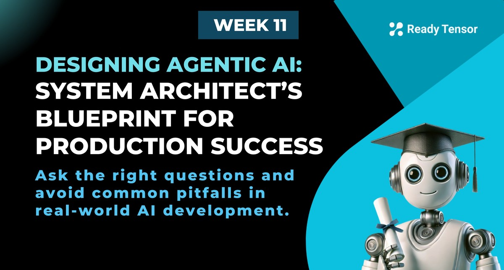

--DIVIDER--

---

[🏠 Home - All Lessons](https://app.readytensor.ai/hubs/ready_tensor_certifications)

[⬅️ Previous - Proprietary vs Open Weight LLMs](https://app.readytensor.ai/publications/Kev4TxRgmnUn)

---

--DIVIDER--

# TL;DR

This lesson teaches you how to think like a system architect when planning and designing agentic AI projects. You’ll learn the key questions to ask at every stage — from scoping and risk assessment to evaluation and architecture — and how your answers shape the system you build. It’s a practical blueprint to help you avoid common pitfalls and increase your chances of building something that actually works in the real world.

---

--DIVIDER--

# The Architect’s Mindset

You’ve made it through 11 weeks of the Agentic AI Developer Certification Program.
Three full modules. Dozens of lessons. A mountain of concepts, tools, techniques, and project work.

By now, you’ve built RAG systems. You’ve designed agents. You’ve chained prompts, used LangGraph, evaluated outputs, added guardrails, and even started thinking about deployment.

So here’s the big question:
**What happens when someone comes to you with a real-world AI problem and says, “Can you build this?”**

This lesson is about preparing for that moment.
Because success in agentic AI isn’t just about knowing how to use the tools — it’s about knowing **how to think**.

Do you actually need agents?
What’s the right architecture?
What should you ask before writing a single line of code?

This is your blueprint for answering those questions like a system architect. It’s how you avoid landmines, make good decisions, and increase the odds that what you build won’t just be impressive — it’ll be useful, stable, and used.

Let’s tie it all together.

---

--DIVIDER--

# What This Lesson Will Cover

We’ll start with four core principles that apply to **any** AI project — agentic or not. These are the mindsets and realities that senior AI developers carry into every conversation, every kickoff, and every decision. If you skip them, it won’t matter how elegant your architecture is.

From there, we’ll walk through a set of **critical thinking checkpoints** across the four main stages of a project:

1.  **Planning** — Decide what you’re building, why it matters, and whether it even needs agents.
2.  **Design and Development** — Choose the right architecture, tools, and tradeoffs for your context.
3.  **Evaluation and Testing** — Define what success looks like and how you’ll measure it.
4.  **Deployment and Monitoring** — Ensure your system holds up in production and keeps improving over time.

For each phase, you’ll see the questions experienced system architects ask — and how the answers shape the system you build.

Then we’ll apply the blueprint to real-world scenarios, so you can see how good thinking leads to working systems.

This isn’t just about getting started — it’s about **staying sharp at every step** of the journey.

---

--DIVIDER--

# Four Principles for Real-World AI Work

Before we get into planning stages and architecture diagrams, let’s zoom out.

Because long before you decide what tools to use — or even whether you need agentic AI at all — you need to ask: **Is this even a good project to begin with?**

Here are four core principles that separate successful AI efforts from the ones that quietly fade out.

---

## 1. **You’re Here to Solve Problems**

A lot of teams start with the wrong question: _“What can we do with agentic AI?”_
That’s backwards.

The right question is: _“What’s the actual problem we’re trying to solve?”_
Only after that do you ask: _“Is agentic AI the right tool for this?”_

If your project starts with the tech instead of the need, you’re already on shaky ground.

---

## 2. **Tie It to a Business Outcome — Always**

This one’s simple, and brutally real: If your project doesn’t move one of these levers…

- 💸 Increase revenue
- 💰 Decrease cost
- 😊 Improve customer experience

…it probably won’t get the support it needs to succeed.
Nice-to-haves don’t survive long.

You don’t have to solve all three — but you **do** need to clearly link your system to at least one. And “it’s cool” doesn’t count.

---

## 3. **No Executive Backing? No Real Project.**

Even great ideas die quietly without someone to fund them, champion them, or protect them when priorities shift.

It’s not just about having a sponsor — it’s about aligning with the company’s **strategic focus**.
If your CEO has declared “this is the year of efficiency,” a project that boosts customer satisfaction might still get greenlit — but it’s the first to be shelved when things get hard.

If the project isn’t tied to a real team, real goals, and real visibility — be careful.
A lack of executive support is one of the fastest ways good AI projects disappear.

---

## 4. **Define What Success Looks Like and What “Done” Means**

A system that “mostly works” can feel endlessly unfinished if no one ever agreed on the goal.

What does success look like?
What metrics matter?
What threshold is “good enough to ship”?

Without that clarity, you’ll end up in a cycle of tweaking, tuning, and justifying — with no finish line in sight.

A good architect defines “done” _before_ building begins.

---

These four principles aren’t just good advice — they’re survival skills.
Keep them in your pocket, especially when the excitement of “Let’s build an AI system!” starts taking over the room.

Now, let’s get into how you actually plan and design one.

---

--DIVIDER--

# Phase 1: Planning

This is where you set up your system for success — or failure — long before a single line of code is written.

> **Did you know that a large percentage of AI projects never make it to production?**
> And the phase where most of them go off track… isn’t agentic design, evaluation or deployment.
> It’s right here — in **planning**.

Why? Because this is where the problem gets framed, the scope gets set, and expectations (realistic or not) start to crystallize.
Get it wrong now, and you’ll spend the rest of the project chasing a moving target — or worse, solving the wrong problem entirely.

So let’s slow down and do this right.

Here are the **key questions** every senior developer or system architect should ask before jumping into design — and the common pitfalls to watch out for.

---

--DIVIDER--

## Core Questions to Ask in the Planning Phase

- **What is the core use case?**
- **Who is the target user?**
- **What specific problem does this system solve?**
- **How does the user currently solve this problem?**
- **What is the expected scale and user volume?**
- **Does this need agentic AI?**
- **What is the definition of success?**
- **What data do we have — and what do we need?**
- **What are the risks if the system fails?**
- **Are there compliance, legal, or regulatory requirements?**
- **Do we need explainability or traceability?**
- **What are the data privacy requirements?**

**📣 Who to Ask**

You won’t have all the answers yourself — and you’re not supposed to. Here’s who to talk to:

- **Product Manager** – for user needs, use case framing, and success criteria
- **Business Stakeholder** – for ROI, priorities, and executive backing
- **Legal or Compliance Lead** – for data handling, privacy, and audit requirements
- **Data / Platform Teams** – for what data exists and what’s needed

---

--DIVIDER--

You don’t have to expand on all of these in every project spec. But you **do** need to talk about them — because every one of them influences architecture, tool choice, and whether the system will be trusted, used, or quietly shelved.

So how do these questions actually group together?

---

--DIVIDER--

 <h3> Start with the Problem </h3>
 
 The first few questions are about one thing: **what problem are we solving?**
 
 You’d be surprised how often that part is fuzzy. No one can quite articulate the problem, or worse — everyone has a slightly different version. If the use case is vague, or solving it doesn’t matter much to the business, that’s a flashing red light.
 
 > A product team might say, “We want an agent to help users with onboarding,” but unless someone can explain what users are struggling with and what “help” actually means, you're not solving a problem — you're building a hope.
 
 Nail this down early. If it’s not a real problem, the solution won’t matter.
 
 ---
 
 <h3> Understand the Scope </h3>
 
 Next, ask: **how big is this problem?**
 Does it affect five internal users, or fifty thousand customers? Will it run once a day, or live on your homepage?
 
 This drives everything from budget to latency to hosting decisions.
 
 > A support agent answering a few internal knowledge base queries can tolerate some rough edges.
 > A customer-facing assistant on a banking app? That one better be fast, accurate, and polite — every time.
 
 ---
 
 <h3> Clarify Goals and Constraints </h3>
 
 Then come the questions that define your **objectives and constraints**.
 
 What does success look like? What data do you have — and what’s missing? What risks are unacceptable? These are the guardrails that shape the edges of the solution space.
 
 > Maybe you're building a research assistant to help analysts synthesize reports. That’s a very different bar than a legal assistant summarizing case documents — especially if the outputs are being pasted into client emails.
 
 These constraints don’t just help you stay on track — they help you say no to distractions and nice-to-haves that don’t move the needle.
 
 ---
 
 <h3> Account for External Requirements </h3>
 
 Finally, don’t forget the extra layers:
 Legal, compliance, audit, explainability, privacy.
 
 These may not come from users, but they absolutely affect what you’re allowed to build — and how.
 
 > If your agent accesses personal medical records, you're in HIPAA territory.
 > If it uses user chat logs to personalize answers, you'd better know where that data goes and how long it’s stored.
 
 Some of the worst surprises in AI projects come from not asking these questions early enough. So make sure they’re part of your planning checklist — even if the answers are “we’re not sure yet.”
 
---

--DIVIDER--

## Example Scenarios

**Question:** _What’s the core use case?_
This may be the most important question in the entire project. If you can’t answer it clearly, everything downstream is at risk.

**Scenario 1: Startup Workflow Assistant**

> _“We want to help users automate repetitive publishing tasks on our platform — like generating titles, summaries, and tags based on their content uploads.”_

✅ **Why this works:**
It’s specific, user-centered, and action-oriented. There’s a clear before-and-after: users currently do this manually, and the agent will handle it. It’s also scoped to a defined workflow — not the entire app.

**What this answer unlocks:**

- Task-based agent design
- RAG with structured context (uploaded content)
- Fast prototyping using existing publishing flows

**Scenario 2: Financial Services Chatbot**

> _“We want a chatbot that can answer all user questions about our financial products.”_

⚠️ **Why this needs work:**
Sounds useful — but it’s **way too broad.** “All questions” spans everything from checking loan eligibility to comparing retirement plans to reporting fraud. You can’t build for that without tighter framing.

**Risk if left vague:**

- No clear success criteria
- Evaluation becomes impossible
- Scope creep kills momentum

**Better version might be:**

> _“We want a chatbot that can answer basic FAQs about mortgage products and link users to the right forms.”_

---

**Scenario 3: Internal Analyst Assistant**

> _“Our data team keeps asking questions in Slack — things like how to write SQL queries or build pivot tables. Maybe AI could help?”_

❌ **Why this is weak:**
This is a symptom, not a use case. It may be pointing to a real pain point, but it’s not yet a problem statement. You don’t know **what kind of help** is needed or **how it fits into their workflow**.

**What to ask next:**

- What kinds of questions come up most often?
- Do analysts want explanations, fixes, or code suggestions?
- Where would they prefer to access this help — Slack, a dashboard, or IDE?
- Who answers these questions now, and how long does it take?
- What happens if the answers are not readily available?

**Danger:** If you jump into building a chatbot too quickly here, you’ll miss the chance to build something simpler and more effective — like surfacing internal docs or training them on SQL patterns.

---

---

--DIVIDER--

**Question:** _What data do we have — and what do we need?_
Agentic AI systems depend heavily on context. If you get the data question wrong, the system will sound confident — and be wrong.

---

**💼 Scenario 1: Startup Workflow Assistant**

> _“We already store the user’s uploaded content and metadata — like post titles, categories, and descriptions. That’s what the agent will work from.”_

✅ **Why this is solid:**
The team knows what’s available and confirms that the input aligns with the system’s job. No need to source new data — just make it accessible to the agent.

**What this answer unlocks:**

- Immediate path to RAG or context injection
- Lower implementation risk
- High alignment between input and goal

**Next step:** verify data format, cleanliness, and whether metadata needs preprocessing.

---

**Scenario 2: Financial Services Chatbot**

> _“We have some internal PDFs, a few wiki pages, and the support team’s Notion board. We’ll just throw them in a vector DB.”_

⚠️ **Watch out:**
This sounds like a plan — but it’s really a **red flag**. Disorganized, inconsistent documents dumped into a vector store won’t magically become a knowledge base. Garbage in, garbage out.

**Risks to flag:**

- No canonical source of truth
- Docs not written for machine consumption
- Fragmented, duplicated, or outdated content

**Better approach:**
Audit and consolidate documents first. Then apply chunking, metadata tagging, and QA evaluation before indexing.

---

**Scenario 3: Internal Analyst Assistant**

> _“We don’t really have structured documentation — the knowledge is scattered across Slack messages and team habits. We were hoping the LLM could just figure it out.”_

❌ **Why this is risky:**
This is a common situation — but it’s dangerous to ignore. Without **any** stable context, the model will hallucinate, mislead, or ask the user things it should already know.

**What to clarify:**

- Can you extract common questions and answers from Slack?
- Is there an opportunity to **start** creating a knowledge base?
- Would embedding this into existing workflows (e.g., Jupyter or BI tools) reduce context needs?

**Sometimes the right move here is to reframe the use case entirely.**

---

--DIVIDER--

# Phase 2: Design and Development

This is where the abstract idea becomes a real, working system.

It’s also the most exciting part — where your AI engineering skills finally get to shine. You’re picking tools, designing architectures, chaining prompts, orchestrating agents. It feels like real progress.

But that excitement can be dangerous.

> The challenge in this phase isn’t ambition — it’s restraint.

The goal isn’t to build the flashiest agent possible. It’s to build the **simplest system that solves the problem you defined in Phase 1.** Anything more is complexity debt you’ll pay for later.

So how do you stay focused?

By asking the right questions — in the right order — before you lock in technical decisions you can’t easily undo.

Let’s walk through the most important ones, grouped into four key areas.

---

## Core Questions to Ask in the Design Phase

- **What are the key technical constraints and priorities?**
- **What are the system’s SLAs and interaction expectations?**
- **What’s the interaction mode?**
- **What failure and recovery behavior is expected?**
- **Should we use an API-based or open-weight model?**
- **What’s the main technology stack (Python, TypeScript, etc.)?**
- **Which orchestration or agent framework fits best (LangGraph, LlamaIndex, etc.)?**
- **What other tooling is needed (for safety, security, evaluations, testing, etc.)?**

**📣 Who to Ask**

Some answers will come from stakeholders, but many will depend on technical context. Talk to:

- **Product Manager** – for user expectations, interaction design, error recovery behaviors
- **Tech Lead / Manager** – for stack decisions, infrastructure realities, security needs
- **Engineering Team** – for latency goals, deployment targets, system constraints

---

You don’t need to lock in every decision at the start — but you **do** need to ask the right questions in the right order. Otherwise, you risk hardwiring limitations into your system before it even comes to life.

Let’s break this phase into three core focus areas.

---

--DIVIDER--

 <h3> Get Clear on Priorities and Constraints </h3>
 
 Every real-world project has tradeoffs. Are you optimizing for time-to-launch, latency, cost, scalability, or flexibility? You won’t be able to maximize everything — so make sure the tradeoffs are explicit.
 
 > If you’re on a tight timeline or constrained budget, you might prioritize fast iteration with API-based tools. But if privacy is non-negotiable, you may need to host open-weight models in-house — even if it slows you down.
 
 Even informal SLA expectations (e.g., “it should respond in under 2 seconds”) can radically shift architecture and model selection. Clarify these constraints early to avoid painful pivots later.
 
 ---
 
 <h3> Design the Right Interaction Model </h3>
 
 Next, figure out how your users (or systems) will interact with the agent.
 
 Is it a one-shot task? A back-and-forth chat? A long-running assistant that maintains memory over time? These interaction models drive how you manage state, memory, and fallback logic.
 
 > A Q\&A bot that answers single-turn queries needs very different logic than an assistant that tracks context across multiple sessions and adapts over time.
 
 Also important: what happens when things break? Can users retry? Interrupt? Get partial answers or graceful fallbacks? These aren’t just UX polish — they’re part of making the system robust and trustworthy.
 
 ---
 
 <h3> Align Tooling with Your Goals </h3>
 
 Now, it’s time to pick your stack. Should you use an API-based model like OpenAI or Anthropic? Or an open-weight model like Mistral or LLaMA? Do you need fine-tuned control — or just fast results?
 
 > Your choices here are shaped by many things: performance needs, privacy rules, cost constraints, and internal skillsets.
 
 Next, choose your orchestration or agent framework. For simple chains, LangChain might be enough. For complex workflows with retries, memory, or conditional routing, LangGraph or LlamaIndex could be a better fit. Or maybe you go custom to keep things lightweight.
 
 Finally, think beyond model calls. What will you use for evaluation? Safety checks? Testing? Observability? A good toolchain doesn’t just help you build — it helps you improve.
 
---

--DIVIDER--

## Example Scenarios

**Question:** _What are the key technical constraints and priorities?_
Every system has guardrails. The best architects don’t fight them — they design with them. This question forces clarity about time, budget, security, latency, tooling, and the broader environment your system will live in.

**Scenario 1: Startup Workflow Assistant**

> _“We’re launching in 3 weeks. It needs to be good enough to demo and test with users. Latency isn’t critical, but cost is. We’ll likely iterate or rebuild once we learn more.”_

✅ **Why this works:**
It’s brutally clear: speed and cost matter more than polish. The team knows they’re building a test balloon, not a fortress.

**What this answer unlocks:**

- Use hosted APIs like OpenAI or Claude
- Skip orchestration frameworks (LangGraph can come later)
- Build in plain Python or LangChain with minimal wrappers
- Minimal eval — maybe just a few human spot checks
- Focus on showing clear, tangible value fast

**Hidden benefit:** This constraint pushes the team to tightly scope the problem — which is usually a good thing.

---

**Scenario 2: Financial Services Chatbot**

> _“We can’t send user data to external services. This has to be hosted on our internal cloud, pass compliance review, and respond within 2 seconds. Logging and audit trails are required.”_

⚠️ **Why this needs careful handling:**
The bar is high: regulatory constraints, privacy concerns, and performance expectations. You can’t default to convenience tools.

**What this answer demands:**

- Open-weight models hosted securely (e.g., LLaMA, Mistral)
- No Pinecone, Chroma, or external vector DBs — use Postgres or in-house retrieval
- Logging with user-level traceability
- Toolchains must support access control and auditing
- Fine-grained control over input/output — possibly custom pre/post-processing

**Watch out for:**

- Unexpected latency issues with self-hosted LLMs
- Overlooking security reviews until it’s too late
- Assuming “compliance” means the same thing to everyone

---

**Scenario 3: Internal Analyst Assistant**

> _“It’s for our data team — they’d like help with SQL and dashboards. Budget’s tight, but we’re open to experimenting.”_

🚨 **Why this is a red flag:**
No clear problem, vague expectations, and heavy constraints. This smells like a solution in search of a use case.

> 🧠 **Architect’s Lens:** Don’t design based on vague impressions. Push for clarity first.

**What to do instead:**
Ask for 5 real analyst questions from the past week. If there’s no clear pattern or repeatable task, this isn’t an agentic AI project — at least not yet.

---

--DIVIDER--

# Phase 3: Evaluation and Testing

This is where you find out if the system works — not just in theory, but in reality.

So far, you’ve scoped the problem, made technical decisions, and built something that runs. But “it runs” isn’t the bar. Now it’s time to ask: **Is it doing the right thing, reliably, and safely?**

> Most agentic systems don’t fail loudly — they fail subtly.
> They drift, route poorly, hallucinate, or degrade in quality over time.

That’s why testing and evaluation aren’t just the final checkbox — they’re a critical part of system design.

---

## Core Questions to Ask in the Evaluation Phase

- **How will we measure performance?**
- **What evaluation methods will we use?**
- **How will we test the system?**
- **What guardrails do we need?**
- **What other safety or security mechanisms are necessary?**

**📣 Who to Ask**

Evaluation is a cross-functional effort. Here’s who to involve:

- **Product Manager** – for defining what “good” looks like from a user and business perspective
- **QA / Test Engineers** – for setting up test coverage and regression strategies
- **Security / Risk Teams** – for safety expectations and abuse prevention
- **Engineering Team** – for implementing eval pipelines, logging, and fallback logic

---

--DIVIDER--

 <h2> Define What “Good” Means </h2>
 
 Start with outcomes. Are you optimizing for accuracy, factual grounding, completion rate, or just user satisfaction?
 
 The right metrics depend on the use case — and it’s rarely just one number.
 
 > A customer support bot might be judged on speed and deflection rate.
 > A research assistant might be evaluated on depth, relevance, and synthesis.
 
 Make your goals measurable, even if that means starting with proxy metrics.
 
 ---
 
 <h3> Make Testing a First-Class Citizen </h3>
 
 Testing in agentic systems isn’t just about unit coverage.
 
 You also need to test:
 
 - Prompt stability (do outputs change with slight phrasing tweaks?)
 - Tool integration (does every tool behave as expected?)
 - Routing and fallback behavior (do the agents do the right thing under pressure?)
 
 > Testing isn’t just “before you ship.” It’s part of every iteration.
 > Without it, your system becomes a black box — and trust starts to erode.
 
 ---
 
 <h3> Build Guardrails and Safety into the Core </h3>
 
 This is where you define what your system is **not** allowed to do.
 
 That includes:
 
 - Output validation (format checks, length limits)
 - Content moderation (for harmful or inappropriate responses)
 - Prompt protection (against injection or jailbreaking)
 - Guarded execution (against misuse of tools or APIs)
 
 > Don’t bolt these on at the end. Make them part of how the system thinks.
 
 ---
 
 <h3> Plan for Real-World Risk </h3>
 
 Finally, zoom out to system-level safety.
 
 What happens when:
 
 - A user floods the system with input?
 - An LLM returns garbage or stalls out?
 - Someone tries to trick the agent into doing something risky?
 
 That’s where things like **rate limiting**, **audit logging**, **fallback policies**, and even **red teaming** come in.
 
 You may not need them all up front — but if the system touches sensitive data or user-facing experiences, they’re non-negotiable.
 
---

--DIVIDER--

## Example Scenarios

**Question:** _What safety or security mechanisms are necessary?_
Not all risks come from the model — some come from users, data, or attackers. This question forces you to ask: _What could go wrong?_ And _what are we doing about it?_

---

**Scenario 1: Startup Workflow Assistant**

> _“It’s live on our public platform. Anyone can use it. It only uses public content — no sensitive data involved.”_

⚠️ **Why this still needs care:**
No private data, but it’s exposed to the world — so **system abuse is a real risk** (spam, prompt injection, misuse).

**What you need:**

- Prompt protection (anti-injection)
- Rate limiting or captcha to prevent abuse
- Output format checks
- Logging for user interactions (anonymized)
- Clear disclaimers or editing options for outputs

> 🧠 **Architect’s Lens:** Public-facing + no auth = assume it will be probed. Protect the system, even if the data isn’t sensitive.

---

**Scenario 2: Financial Services Chatbot**

> _“It’s customer-facing. We handle sensitive data. It’s also a potential target for bad actors trying to extract information or exploit the system.”_

🚨 **Why this is high-risk:**
This system is both **compliance-sensitive** and **attractive to attackers**. That’s a dangerous combo.

**What you need:**

- Strong content moderation and red-teaming
- Prompt injection defenses
- Role-based access (no over-privileged tools)
- Input/output logging with traceability
- Secure deployment with network isolation
- Legal + security team review of all behaviors

> ⚠️ **Landmine Alert:** LLMs are soft targets. If you’re in finance, _assume you’ll be attacked_ — and design like it.

---

**Scenario 3: Internal Analyst Assistant**

> _“It’s only used by our internal data team. No sensitive data involved. Occasional errors are okay as long as it’s generally useful.”_

✅ **Why this is low risk:**
Internal tool, trusted users, no sensitive inputs — which gives you room to move fast and learn.

**What you need:**

- Basic output validation (e.g., SQL schema checks)
- Friendly fallbacks (“I’m not sure” or let users edit)
- Light logging for debugging
- No heavy moderation needed

> 🧠 **Architect’s Lens:** This is an ideal setting for iteration. Keep things simple — just make sure outputs are _plausible_ and editable.

---

--DIVIDER--

# Phase 4: Deployment and Monitoring

While deployment and monitoring may not be your responsibility as an AI Developer — you should **still know what to look for**.

> You’re not just handing off a model. You’re shipping a system.

And once it’s out in the world, your job isn’t over — it’s just changed. Now it’s about resilience, observability, and feedback loops.

---

## Core Questions to Ask in the Deployment Phase

- **Where and how will this system be deployed?**
- **How will we handle failure and fallback?**
- **How will we monitor the system in production?**
- **How will we collect user feedback or iterate over time?**

**📣 Who to Ask**

- **DevOps or Infra Team** – for deployment strategy, scaling, and failure handling
- **Engineering Team** – for monitoring tools, logging, and observability pipelines
- **Product Manager** – for feedback collection and iteration loop
- **Customer Support / QA** – for what “breakage” looks like in production

---

 <h3> Deployment Isn’t the End </h3>
 
 Whether your system runs as a web API, an internal dashboard, or a live assistant on your product — it needs to be monitored like any production system.
 
 That includes:
 
 - Clear failure modes and graceful fallbacks
 - Observability tools (LangSmith, Langfuse, OpenTelemetry, custom logs)
 - Logging edge cases and decision traces
 - Feedback channels (thumbs up/down, flags, human escalation paths)
 
 > You can’t fix what you can’t see. So give yourself visibility from Day 1.
 
 Shipping is just the beginning. A real system learns and improves.
 Make sure yours is set up to do the same.
 
 ---

--DIVIDER--

## Example Scenarios

**Question:** _How will we monitor the system in production?_
Monitoring isn’t a checkbox — it’s your lifeline once the system goes live. The real question is:

> “What signals do we need to detect success, spot failure, and meet expectations — technical or regulatory?”

---

**Scenario 1: Startup Workflow Assistant**

> _“It’s public and used by the community. We want to know if people are using it — and if they find it helpful. If someone rates it unhelpful, we might want a full trace of what happened.”_

✅ **Why this is focused:**
You don’t need full-blown observability — just **impact tracking and failure insight.**

**What you want to monitor:**

- Basic usage metrics (queries per day, feature engagement)
- Feedback collection (helpful/unhelpful votes, retry rates)
- Full session trace only for flagged interactions
- Optionally: user drop-off after bad outputs

> 🧠 **Architect’s Lens:** You don’t need 24/7 dashboards — you just need enough signal to know if it’s working and how to improve it.

---

**Scenario 2: Financial Services Chatbot**

> _“It’s customer-facing, high-stakes, and must meet compliance. We need full observability — but also need to strip out PII. Plus, hallucinations and latency directly impact user satisfaction.”_

🚨 **Why this requires depth and discipline:**
You need **complete, secure, and privacy-compliant tracing** — with metrics that reflect quality, not just system health.

**What you want to monitor:**

- Full tracing of inputs, outputs, tool calls, and routing paths
- PII redaction or obfuscation before storage
- Hallucination detection (e.g. missing citations, low-confidence grounding)
- Latency metrics and real-time alerts on slow responses
- Escalation tracking (when user falls back to human or fails task)
- Exportable, queryable logs for audit purposes

> ⚠️ **Landmine Alert:** Logging everything without redacting PII is just as risky as logging nothing.

---

**Scenario 3: Internal Analyst Assistant**

> _“It’s an internal tool with a small number of users. Observability would be nice, but it’s not essential.”_

✅ **Why this is perfectly reasonable:**
Low risk, limited audience, no SLAs. You can choose whether to monitor at all.

**What you want to monitor (if anything):**

- Simple logs of queries and errors (optional)
- Manual feedback (“this answer didn’t help”)
- Occasional sampling of usage patterns for iteration

> 🧠 **Architect’s Lens:** This is a “nice-to-have” case. Don’t waste time on dashboards if no one’s looking at them.

---

--DIVIDER--

# Architect’s Playbook: Final Takeaways

 <h3> 🔍 Start with ruthless clarity </h3>
 
 Every strong system starts with a clear problem, a real user, and a concrete goal. If you can’t explain why the system needs to exist — and what it will change — you’re not ready to build.
 
 <h3> 🧱 Build the simplest thing that solves the problem </h3>
 
 Good architecture isn’t about cleverness — it’s about clarity. Leave your ego at the door. Don’t overengineer. The best systems are the ones that quietly do their job and are easy to improve later.
 
 <h3> 🧪 Test for reality, not perfection </h3>
 
 Don’t ask, “Is it perfect?” Ask, “Will it do the right thing most of the time, even under stress?” The goal is reliability, not ideal conditions.
 
 <h3> 👁️ Build for visibility </h3>
 
 Once it’s live, the biggest risk isn’t failure — it’s silence. You need to see what’s happening. If something goes wrong and no one knows why, you haven’t built a system — just a guess with an interface.
 
 <h3> 🛑 Know when to say no </h3>
 
 Not every problem needs an agent. Some don’t need AI at all. Recognizing that early is one of the most valuable skills you can develop.
 
 <h3> ✅ Define “done” </h3>
 
 Without a shared definition of success, you’ll never ship. Decide upfront what good enough looks like — then build toward it with confidence.
 
 ---
 
 > You now have the mindset, tools, and questions of a system architect.
 > Use them to make smarter decisions — and build systems that actually work.
 
 ---
 
 Congratulations — you’ve reached the final technical lesson of this program!
