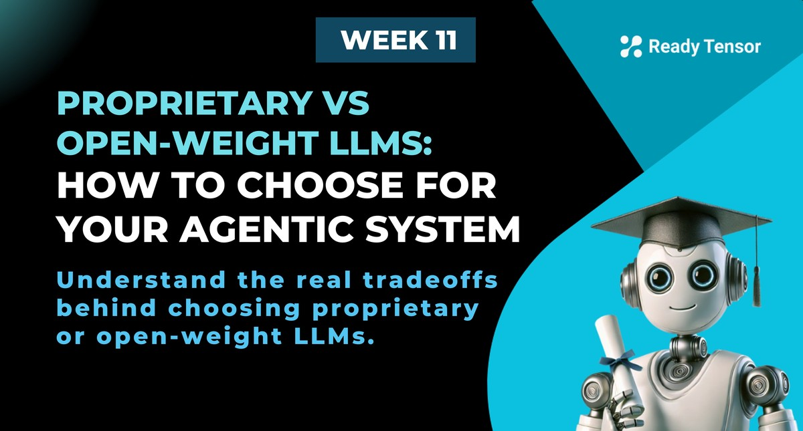
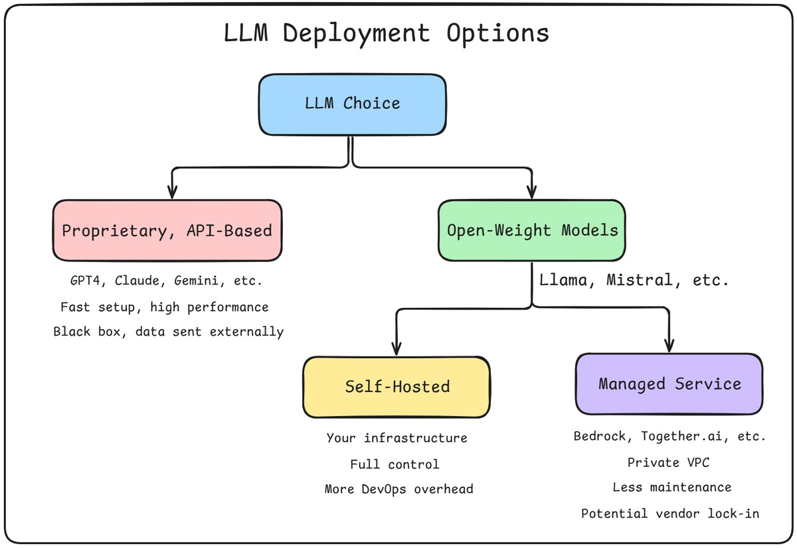
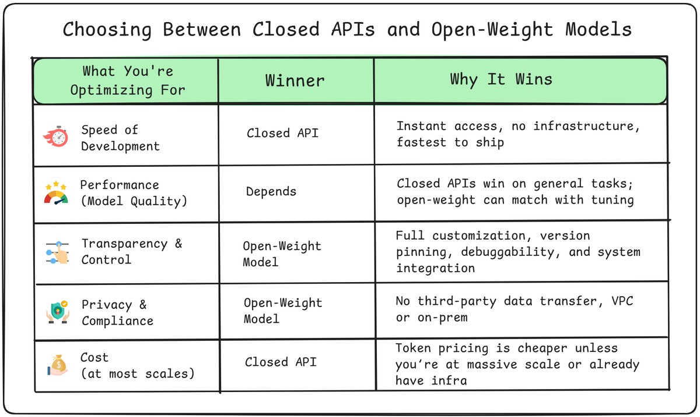

--DIVIDER--

---

[🏠 Home - All Lessons](https://app.readytensor.ai/hubs/ready_tensor_certifications)

[⬅️ Previous - Data Privacy and Compliance in Agentic AI](https://app.readytensor.ai/publications/hQirE9Zfqpje)

---

--DIVIDER--

# TL;DR

Choosing the right LLM means deciding between proprietary APIs and open-weight models. Proprietary options offer ease and cutting-edge performance, while open-weight models provide more control, privacy, and flexibility. This lesson breaks down the tradeoffs — and the hosting options — so you can make the right call for your agentic system.

---

--DIVIDER--

In the previous lesson, we explored how data privacy and compliance requirements shape your system design — from GDPR's right to deletion to HIPAA's restrictions on PHI sharing. Now let's see how those same requirements influence one of your most critical architectural decisions: which LLM to use and where to run it.

The choice between proprietary APIs and open-weight models isn't just about performance or cost. It's about **who controls your data pipeline** — and whether you can meet the privacy promises you made to your users.

---

--DIVIDER--

# The Big Decision: What Kind of LLM Should You Use?

If you’re building an agentic system, one of the first architectural choices you’ll face is this:

> _Do you build around a closed-source API like GPT-4, or choose an open-weight model you can run yourself?_

This isn’t a simple “which model is better” debate. It’s a decision about **control**, **transparency**, **compliance**, and **long-term cost**. Closed models can offer incredible out-of-the-box performance, but they’re black boxes. Open-weight models might take more effort to use — but you own the stack, and you decide how it evolves.

And while it might seem like the choice only affects developers or infrastructure teams, it runs deeper. Your answer will shape how flexible your system can be, how safe your data is, how easily you can scale, and how well you can audit or explain your AI’s behavior down the line.

Let’s break it down.

---

--DIVIDER--

--DIVIDER--

## Proprietary APIs: Powerful but Opaque

If you’re using OpenAI’s GPT-4, Anthropic’s Claude, or Google’s Gemini, you’re not running the model — you’re just sending data to someone else’s servers and getting a response back.

And in return, you get a lot: world-class performance, smooth developer tooling, constant improvements. It’s hard to beat the convenience.

But what you don’t get is **transparency**.

These models are closed-source and closed-weights, essentially a black-box.

You can’t inspect the model. You can’t freeze the version. You don’t know what data it was trained on, or when it will change. And you definitely can’t run it inside your secure environment unless you’re on an enterprise-tier plan with private deployment options.

That means every request comes with risk: legal, operational, and reputational. Even if your API provider says they won’t train on your data, you’re still sending sensitive information across the wire — and relying on a third party to handle it responsibly.

For some teams, that tradeoff is fine. But for agentic systems working with sensitive docs, private records, or user inputs that require strong compliance controls, it quickly becomes a blocker.

---

--DIVIDER--

:::info{title="Info"}
Note: Some proprietary providers now allow version pinning — for example, `gpt-4.1-mini-2025-04-14`. This helps reduce surprise updates, but you still don’t control when new versions are introduced or what’s changed under the hood. It’s transparency by label, not by design.
:::

--DIVIDER--

## Open-Weight Models: Control, Privacy, Customization

Now let’s flip the script.

Instead of sending your data to a model, what if the model came to you?

Open-weight models like **LLaMA 3**, **Mistral**, **Qwen**, and **DeepSeek** give you the flexibility to host the model wherever you want — on your laptop, in your private cloud, behind your firewall.

That means no more API gatekeeping. No more wondering if your prompts are being logged. No more last-minute model updates breaking your prompt chains. Just full control over how, where, and when the model runs.

This also opens the door to customization. You can fine-tune the model on your data, adjust its behavior, pin a specific version, or even swap out the backbone entirely as new open models emerge.

The downside? You’ll need to make a few more decisions. Which model do you use? How do you host it? Who manages the infrastructure?

That brings us to the next layer of the decision.

---

--DIVIDER--

## Hosting Open-Weight Models: Two Paths

Once you decide to go with an open-weight model, you’ve got one more choice to make:

> _Do you host the model yourself, or let someone else do it for you?_

You can spin up your own infrastructure — using GPUs on AWS, GCP, or even on-prem — and run models directly. This gives you total control over the stack, from latency tuning to custom model adapters.

Or you can use a managed service like **Amazon Bedrock**, **Fireworks**, **Hugging Face Inference Endpoints**, or **Together.ai**. These let you run open-weight models inside a **private, secure VPC** — without managing the servers yourself.

Here’s the key idea:

> This isn’t about privacy anymore. Either path can be compliant and secure.
> This is about **who owns the infrastructure** — and how much you want to customize.

Self-hosting gives you the most flexibility but also demands the most engineering effort. Managed services offer convenience, autoscaling, and monitoring — but you trade away some of the deep stack control.

Either way, the good news is: you’re still using open models on your own terms. And that’s a big leap from relying entirely on black-box APIs.

---

--DIVIDER--

:::info{title="Info"}

 <h2>Open-Source and Open-Weight: What's the Difference?</h2>
 
 This matters, especially when you're thinking about licensing, deployment, or customization.
 
 - **Open-weight** means the model weights are downloadable and usable — sometimes with restrictions (e.g. non-commercial use).
 - **Open-source** means the entire stack — weights, code, training data, training scripts — is published under a permissive license (like Apache 2.0 or MIT), with few to no restrictions.
 
 In most applied cases — like building a research assistant or AI chatbot — **open-weight is enough**. You don’t need to re-train or re-publish the model. You just need to run it, and maybe fine-tune it.
 
 If you’re building internal tools or privacy-sensitive systems, the key question isn’t “Is it open-source?”
 It’s: _“Can I run this model privately, securely, and cost-effectively?”_
 
 > 📜 Some open-weight licenses (e.g. Meta's LLaMA) permit commercial use below certain usage thresholds (which are quite generous). Always check the license terms before deploying in production or revenue-generating environments.
 
 :::
 
 ---

--DIVIDER--

# The Real Tradeoffs: What Are You Optimizing For?

There’s no universally “correct” way to use LLMs — there’s only the right choice for your **system**, your **team**, and your **constraints**.

The tradeoff isn’t just between OpenAI and LLaMA. It’s about what you’re optimizing for:

---

--DIVIDER--

 <h2> Speed of Development </h2>
 
 Let’s not pretend this doesn’t matter.
 
 If you're racing to ship a demo, test an idea, or get your agent into users' hands fast, there's no faster path than calling a commercial API. No infrastructure. No hosting. No DevOps. You hit the endpoint and you're done.
 
 Open-weight models — even if you use a managed service — add a bit of friction. You’ll need to pick a model, configure inference, and possibly deal with tokenization quirks or resource limits.
 
 It’s not hard, but it’s not zero-effort either.
 
 APIs let you move fast today.
 Open-weight models help you move freely tomorrow.
 
---

--DIVIDER--

 <h2> Performance (Model Quality) </h2>
 
 Closed APIs typically offer the highest raw performance on general tasks. Models like GPT-4 or Claude Opus are heavily optimized and fine-tuned across broad domains — and they often outperform open-weight models out of the box.
 
 Open-weight models have improved dramatically and can match or even surpass APIs on certain tasks — especially with domain tuning or prompt engineering. But out of the box, they still tend to lag behind top proprietary models in general-purpose reasoning and instruction following.
 
 > APIs win on default model quality. Open models can catch up — with work.
 
---

--DIVIDER--

 <h2> Transparency & Control </h2>
 
 Closed APIs are black boxes. You can’t see how the model was trained, what changed in the last update, or why it produced a certain output. You’re also locked into their defaults — from tokenization quirks to rate limits to behavior updates.
 
 Open-weight models flip the script. You choose the model version. You host it where and how you want. You can fine-tune it, inspect intermediate steps, log everything, and debug it when things go wrong. You can also run adversarial or edge-case testing without hitting rate limits, moderation filters, or ToS violations.
 
 That level of transparency and control becomes essential when building agentic workflows, evaluating safety, or pushing model boundaries in regulated domains.
 
 > Open models give you agency and sovereignty.
 
 ---

--DIVIDER--

 <h2> Privacy & Compliance </h2>
 
 If your system touches regulated data — think patient records, legal briefs, financial reports, or internal company docs — then closed APIs raise tough questions.
 
 Even with data encryption and enterprise agreements, you're still transmitting user content to a third party. You don’t own the pipe, and you don’t fully control where the data lands.
 
 Open-weight models, by contrast, can be run entirely within your infrastructure — or within your Virtual Private Cloud (VPC) using services like Bedrock. Either way, you eliminate the external transmission risk.
 
 > Want a clean answer in a security review? “No data leaves our environment” is hard to beat.
 
---

--DIVIDER--

 <h2> Cost </h2>
 
 In 2025, **API-based models are more cost-effective for most workloads** — even at moderate or high scale. With optimized offerings from OpenAI, Anthropic, and Google priced between \$0.15 per million tokens (for cheaper models) and \$15 per million tokens (for higher-end models), you can serve tens of millions of messages per month for just a few hundred dollars.
 
 Self-hosting open-weight models introduces significant overhead:
 
 - GPU infrastructure (cloud or on-prem)
 - DevOps, scaling, and uptime engineering
 - Ongoing monitoring and optimization
 
 Even with quantization and batching, it’s hard to match the efficiency and pricing of mature API services — unless you’re operating at **massive scale**, or already have infrastructure in place.
 
 > For most teams, **APIs win on cost** until you’re deep into enterprise-scale volumes.
 
---

--DIVIDER--

> > **So What’s the Right Call?**

There isn’t one.

But here’s the north star:

- **If you’re prototyping, experimenting, or just need best-in-, generalized IQ** — use a closed API.
- **If you’re scaling, handling sensitive data, or want to own your system long-term** — go open-weight.
- **If you’re somewhere in between** — use both. Build a hybrid setup. Fall back to APIs when needed, but run open models for day-to-day operations.

Your system will evolve. Your needs will grow. Your risks will change.

> This lesson isn’t about picking a side.
> It’s about understanding the stakes — so you can make smart, confident tradeoffs.

---

--DIVIDER--

# Major Open Source LLMs in 2025

Let's take a look at some of the most prominent open-source LLMs as of mid-2025, their key features, and application areas:

| Model             | Developer              | Parameters | Features                                            | Notable Uses             | License    |
| ----------------- | ---------------------- | ---------- | --------------------------------------------------- | ------------------------ | ---------- |
| **Llama 3.1**     | Meta AI                | 8B–405B    | High multilingual, long context (128k), chat/coding | General NLP & Coding     | Permissive |
| **Mistral Large** | Mistral AI             | 7B–22B+    | Efficient attention, group-query, MoE variants      | Chat, task-specific bots | Apache 2.0 |
| **DeepSeek R1**   | DeepSeek AI            | 9B–67B+    | Superior reasoning, 128k context, scientific focus  | Advanced reasoning, tech | Permissive |
| **Qwen 2.5**      | Alibaba DAMO           | Up to 72B  | Top open coding, 20+ languages, massive context     | Coding, chat, Q&A        | Permissive |
| **Falcon 180B**   | TII                    | Up to 180B | Multilingual, code, long context, high performance  | Multilingual, code       | Apache 2.0 |
| **OLMo**          | Allen Institute for AI | 7B+        | Full stack open, easy research, reproducibility     | Research                 | Apache 2.0 |
| **K2**            | LLM360/Petuum/MBZUAI   | 65B        | Fully open, rigorous benchmarks, transparent        | Reference, custom AI     | Apache 2.0 |
| **BLOOM**         | BigScience             | 176B       | 46 languages, 13 programming languages              | Multilingual NLP         | RAIL       |
| **MPT**           | MosaicML               | 7B–30B     | Modular, cost-efficient, tuned for deployments      | SaaS/NLP backbone        | Apache 2.0 |
| **h2oGPT**        | H2O.ai                 | 7B–40B     | Multi-resolution decoder, hierarchical encoder      | Conversational AI        | Apache 2.0 |
| **Phi-2**         | Microsoft              | 2.7B       | Lightweight, next-word prediction, efficient        | Small-scale, research    | MIT        |

---

--DIVIDER--

# Recommended Open-Weight Models for Agentic Systems

You just saw a high-level comparison of popular open-weight models. Now let’s narrow it down to a few that work particularly well in agentic AI systems, and explain when to use each.

But first, two important caveats:

1.  **The open-weight model landscape changes fast.**
    What’s “state-of-the-art” today could be obsolete next month. New checkpoints, fine-tunes, and architectures drop every week.

    > _Check recent leaderboards like Hugging Face’s Open LLM Leaderboard or LMSYS Chatbot Arena._

2.  **Benchmarks don’t tell the whole story.**
    Just because a model ranks high doesn’t mean it will work best for your agent. You need to test models on your own tasks, prompts, and workflows.
    > _YMMV — and in agentic systems, “best” often means “best for your setup.”_

That said, if you’re wondering where to start — here’s a shortlist of **open-weight models that have proven reliable across many agentic use cases** in 2025.

---

--DIVIDER--

 <h2>General-Purpose Assistant: LLaMA 3 </h2>
 
 * **Sizes:** 1B and 3B (LLaMA 3.2) and 70B (LLaMA 3.3)
 * **Strengths:** Excellent reasoning, multilingual, long context (128k), top-tier instruction tuning
 * **Use it when:** Uou need a capable assistant or general-purpose agent that can follow instructions, synthesize information, and handle diverse inputs.
 
 > The 1B and 3B variants of LLaMA 3.2 work well for lightweight chatbots. But if you're building a serious agentic system, LLaMA 3.3–70B is the new open-weight standard.
 
---

--DIVIDER--

 <h2>Coding & Dev Tools: Qwen 2.5</h2>
 
 * **Sizes:** 1.5B to 72B
 * **Strengths:** Best-in-class code generation, 20+ languages, long context, strong chat alignment
 * **Use it when:** You’re building dev agents, doc converters, or code refactorers.
 
 > Think of it as the open-source Codex — but smarter and multilingual.
 
---

--DIVIDER--

 <h2>Reasoning & Analysis: DeepSeek R1</h2>
 
 * **Sizes:** 9B to 67B+
 * **Strengths:** Trained for logic, synthesis, and structured output; excels at academic or analytical content
 * **Use it when:** You need agents to critique, summarize, compare, or generate structured longform output.
 
 > Ideal for critique loops or knowledge synthesis agents.
 
 ---

--DIVIDER--

 <h2>Multilingual & Long Input: Falcon 180B</h2>
 
 - **Strengths:** Handles long context, multilingual data, and code with high throughput
 - **Use it when:** Your workloads span languages, long documents, or region-specific deployments.
 
 > Great for enterprise-scale agents serving global users.
 
---

--DIVIDER--

 <h2>Lightweight & Fast: Mistral 7B / Phi-2</h2>
 
 - **Phi-2 (2.7B):** Surprisingly strong for its size — good for local inference or mobile/edge use cases
 - **Mistral 7B:** Highly efficient, great for chat or task agents in resource-constrained environments
 
 > These are the go-to models for fast prototypes and low-latency use cases.
 
 ---

--DIVIDER--

# Decision Cheatsheet: What Should You Do?

Let’s bring it all together.

By now, you’ve seen the tradeoffs between closed APIs and open-weight models. So… which path should you take?

Here’s a quick cheatsheet based on your goals and constraints:

---

 <h2> Use a Closed API if… </h2>
 
 - You want **the best model quality** out of the box (e.g., GPT-4, Claude Opus)
 - You’re in **prototyping mode** or launching quickly
 - You don’t want to deal with infrastructure
 - Your system doesn’t handle **sensitive or regulated data**
 - You need consistent performance at **low to moderate scale**
 
 > Think: MVPs, early-stage agents, R\&D projects, small team tools, non-regulated / low-risk applications
 
 ---
 
 <h2> Use an Open-Weight Model if… </h2>
 
 - You care about **data privacy or compliance**
 - You need **version stability** or model transparency
 - You want to **customize, fine-tune, or extend** the model for a specific domain
 - You’re operating at **large scale** and need predictable cost
 - You’re building a **core system** that needs full-stack control
 
 > Think: regulated environments, specialized domains (e.g. medical, legal), internal copilots, multi-agent systems
 
 ---
 
 <h2>  Or go hybrid: </h2>
 
 Use open-weight models as your **default inference stack** (e.g. via Bedrock or a self-hosted endpoint), and **fall back to a closed API** for high-complexity tasks or overflow capacity.
 
 > This is often the most practical setup for real-world systems — balancing control, coverage, and resilience.
 
---

--DIVIDER--

# How to Host Efficiently (If You Go That Route)

Decided to go open-weight? Great — now let’s make it efficient.

You don’t need racks of GPUs or a PhD in ML infra to run a model like LLaMA 3 or Mistral. But you do need to be smart about optimization and deployment.

Here’s how to host without burning your GPU budget.

---

--DIVIDER--

 <h2>1. Use Quantization to Shrink the Model</h2>
 
 Running a model in 8-bit or 4-bit precision dramatically reduces memory usage and cost — often with little to no loss in quality.
 
 Start with tools like:
 
 - [`bitsandbytes`](https://github.com/TimDettmers/bitsandbytes) for 8-bit
 - [`GGUF`](https://github.com/ggerganov/llama.cpp) or `QLoRA` for 4-bit
 
 > Quantized models can run on a single A100 or even consumer GPUs like the 4090.
 
 ---
 
 <h2>2. Choose the Right Inference Framework</h2>
 
 Use optimized serving stacks built for high-throughput inference. Top options include:
 
 - **vLLM** (used by many production deployments)
 - **TGI** (Hugging Face’s Text Generation Inference)
 - **LMDeploy** (open-source, battle-tested, MLC-compatible)
 
 These support batching, token streaming, and low-latency serving.
 
 ---
 
 <h2>3. Pick Your Hosting Strategy</h2>
 
 You’ve got three common options:
 
 - **Local Dev / Prototyping:**
   Use tools like [Ollama](https://ollama.com/) or [LM Studio](https://lmstudio.ai/) to run quantized models locally.
 
 - **Cloud Hosting:**
   Rent A100s or 4090s from RunPod, Lambda Labs, or your cloud provider (AWS, GCP, Azure). Build autoscaling around peak load.
 
 - **Inference-as-a-Service:**
   Services like **Amazon Bedrock**, **Together.ai**, and **Fireworks** let you run open models in a VPC — without managing infra.
 
 ---
 
 <h2>4. Optimize Everything</h2>
 
 Don’t stop at loading the model. Tune your:
 
 - **Batch size and prompt window**
 - **Token streaming vs. full responses**
 - **Caching and reuse across turns**
 
 And don’t forget to monitor cost, uptime, and failure patterns — just like you would with any production service.
 
 ---
 
 > Hosting open-weight models in 2025 is no longer a DevOps nightmare. With the right tools and a bit of setup, you can build scalable, compliant, and cost-effective agentic systems — all on your terms.
 
---

--DIVIDER--

# Final Takeaway: Choose Your Path — and Own It

There’s no universal best practice when it comes to LLM deployment — only the best fit for your specific needs.

Some teams need speed and simplicity. Others need control, privacy, or cost predictability. And some need all of it — which is why hybrid architectures are on the rise.

But here’s what’s non-negotiable: **you should know exactly why you’re choosing what you’re choosing**.

- Don’t default to GPT-4 just because it’s familiar.
- Don’t self-host a massive model just because it feels “enterprise.”
- And don’t blindly trust leaderboards or hot takes on X.

Instead, understand the tradeoffs. Talk to your security and infra teams. Test a few options. And make the decision that actually serves your users and your system.

---

--DIVIDER--

---

[🏠 Home - All Lessons](https://app.readytensor.ai/hubs/ready_tensor_certifications)

[⬅️ Previous - Data Privacy and Compliance in Agentic AI](https://app.readytensor.ai/publications/hQirE9Zfqpje)

---
